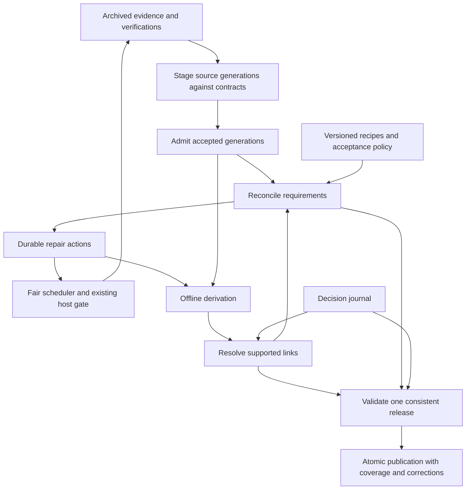

# Self-healing and publication accuracy

Status: accepted for implementation, 2026-09-12. Not yet implemented; each
contract changes only when the rollout revision that owns it lands, in the
order set by [implementation plan v2](implementation-plan-v2.md). Based on the
[systemic audit](../research/self-healing-2026-09-12.md) and the
[curated-dataset research](../research/curated-datasets-state-of-the-art-2026-09-12.md).
The work plan is the [rollout](self-healing-rollout.md).

Swingset should continually reconcile its data against explicit requirements
for evidence, freshness, and derivation. Keep Python, SQLite, the archive,
offline transformations, systemd, and atomic Hub publication. This proposal
changes their contracts. It adds no scheduler and no database. Every piece
extends an existing record, table, file, or command rather than adding one
beside it; the [terms](#terms) name the extension in each case.

Source admission and durable correction memory come before broad automatic
repair. More reliable retries would otherwise repeat flawed interpretations or
restore rejected identities.

## Terms

These terms are used exactly as defined below. On acceptance they move to the
[glossary](glossary.md).

| Term               | Meaning                                                                                                                                                                                                       | Extends                                                                                                                                          |
| ------------------ | ------------------------------------------------------------------------------------------------------------------------------------------------------------------------------------------------------------- | ------------------------------------------------------------------------------------------------------------------------------------------------ |
| Recipe             | The fingerprint of a stage's built runtime artifact plus its captured policy, schema, configuration, and dependency inputs. Qualified by stage: interpretation, linking, acceptance.                          | Replaces `extract_version`, `parser_version`, `PROJECTOR_VERSION`, and `LINKER_VERSION` as the identity of a stage. The names stay as labels.    |
| Verification       | A successful content check joined to a successful interpretation of that content under the current interpretation recipe. Usable verification is the latest such record for a watch.                          | New record beside `watches.last_checked_at`, which stays as the attempt time.                                                                    |
| Unit               | One finite source read with a source-native key. A single-page kind's unit is its watch. A paginated index's unit is the parent watch with its page children.                                                 | Watch.                                                                                                                                           |
| Page-kind contract | The versioned declaration of what a unit must contain, witness, and guard, and what it may retire.                                                                                                            | The page-kind contracts in `sources/base.py`, which gain the fields in [section 2](#2-page-kind-contracts-and-admission).                        |
| Guard              | A named contract check with a severity, rationale, evidence, and reviewed policy version.                                                                                                                     | New contract field.                                                                                                                              |
| Coverage witness   | The evidence a unit offers that its enumeration is complete, or the precise limitation when it cannot.                                                                                                        | New contract field.                                                                                                                              |
| Removal authority  | The source-owned claims that an accepted complete enumeration of a unit may retire by absence.                                                                                                                | New contract field.                                                                                                                              |
| Generation         | One immutable, fingerprinted output of a stage for a scope. A source generation is a unit's staged observation set with its input manifest. A derivation generation is a scope's rows with their fingerprint. | A watch's observation set and a scope's projection, kept as immutable versions instead of overwritten in place.                                  |
| Admission          | The transaction that selects a staged source generation as current and records downstream invalidation.                                                                                                       | The parse writer's observation replacement transaction.                                                                                          |
| Requirement        | A durable record that a scope does not meet an evidence, freshness, or derivation rule, with its state, next action, attempt history, and blocking reason.                                                    | Finding. A finding is a requirement whose next action is human review.                                                                           |
| Requirement kind   | The rule a requirement checks. Kinds are the rows of the [requirements table](#3-requirements-one-inventory-for-gaps-findings-and-derivation-work) and the selector for pauses and status filters.            | Finding kind.                                                                                                                                    |
| Cohort             | A named set of requirements with immutable membership, scope, policy, and baseline time, used to report progress on bounded work.                                                                             | New.                                                                                                                                             |
| Source reference   | A result subject's identity in its source: source event, native contest or round identity, and native participant or judge identity where available.                                                          | The existing source reference, extended from events to entries and judges.                                                                       |
| Decision journal   | The append-only record of reviewed identity decisions keyed by source reference.                                                                                                                              | `overrides/identity_overrides.csv`, made append-only with the columns in [section 6](#6-accuracy-resolve-links-before-populating-default-joins). |
| Link               | An identity claim with its evidence, decision IDs, acceptance policy version, and state: accepted, revoked, or superseded.                                                                                    | The existing link, which gains states and decision IDs.                                                                                          |

Uncertain matches keep their existing home, `link_candidates`. There is no
separate hypothesis table.

## Guarantees

1. **Recovery:** every known, in-scope unmet requirement has a durable
   explanation and either a scheduled action or a recorded reason automatic
   repair cannot proceed. A failed attempt does not erase the requirement.
2. **Convergence:** when relevant evidence and recipes stop changing, supported
   repairs succeed, storage is recoverable, and scheduled work receives
   capacity, the published result eventually equals a clean rebuild from that
   evidence and those recipes. Incremental processing and full rebuilding agree.
3. **Correction:** new contrary evidence can revoke an earlier link. All
   affected joins and derived values are reconsidered, including old events.
4. **Publication safety:** default facts meet a versioned acceptance policy at
   the release's evidence cutoff. Unresolved candidates and contradictory claims
   do not become facts through a high matching score.
5. **Visible limits:** unresolved scope, source absence, stale evidence, and
   unsupported interpretation remain distinguishable in published coverage.
6. **Operator control:** collection and repair can be paused by host, source,
   or requirement kind, then resumed from durable checkpoints. Restart does not
   clear a pause, discard work, reset budgets, or start the backfill over.
7. **Trackable progress:** `swingset doctor` explains what has completed, what
   remains, what is blocked or paused, and what has reached publication.

**Completion rule.** A requirement closes only when its postcondition is checked
against current inputs under the current recipe. Nothing closes it by
succeeding: not an HTTP 2xx or 304, a job exit code, a row count, a valid
foreign key, a heartbeat, a request rate, a model call, or a higher linked-row
count. The same rule governs progress reports, activation gates, and release
validation. Later sections rely on this rule and do not repeat it.

Convergence is conditional on obtainable evidence and a working interpreter; it
cannot repair a source that publishes an incorrect fact with no contrary
evidence. Accuracy therefore also needs source validation, conservative link
acceptance, and ongoing evaluation. The guarantee applies to the latest release.
Downloaded or pinned releases cannot be corrected in place; each correction
needs an attributable new release.

## Proposed flow

Reconciliation runs at startup, periodically, and after relevant changes. It
runs even when ordinary work is pending. Fetching remains the only path to
source sites; reconciliation and derivation inspect local state.

## 1. Verification: separate checking, content, and interpretation

Deepen the fetch, archive, and parse write path into an evidence module. Its
interface records a fetch attempt and a successful interpretation, then exposes
the best usable evidence for a watch under a specified interpretation recipe. It
owns the conditions under which freshness may advance.

| Fact                                 | Meaning                                                                                                    |
| ------------------------------------ | ---------------------------------------------------------------------------------------------------------- |
| Last attempted check                 | A request was attempted; errors may update this.                                                           |
| Last successful content verification | The source returned a recognized representation, or validated an intact cached one.                        |
| Content identity                     | Hash of the archived representation; unchanged checks reuse it.                                            |
| Last semantic change                 | The interpreted claims changed.                                                                            |
| Interpretation recipe                | Executable artifact, parser and extractor policy, and relevant dependencies used to interpret the content. |
| Last successful interpretation       | Which content was accepted under which recipe.                                                             |
| Source observation time              | When the source evidence describes the world; historical archive time differs from retrieval time.         |

A 304 renews verification only if its cached representation exists, passes its
hash check, and has a successful interpretation under the required recipe. A
recipe change can invalidate interpretation without another origin request. An
identical successful response renews freshness without replacing historical
claim provenance or relinking every event. An error never renews it. A
recognized not-found response is time-bounded negative evidence, not proof that
an identifier never existed or will never exist.

Keep verification records compact and local. Do not archive another full body
for every identical check. A public freshness summary can update at a bounded
cadence without rewriting fact tables on every poll. RFC 9111 grounds freshness
renewal for a validated cached representation; see
[HTTP validation](https://www.rfc-editor.org/rfc/rfc9111.html#section-4.3.3).

### Registry verification

Record each usable verification with its watch, check time, content hash,
interpretation recipe, and semantic outcome (`found` or recognized `not_found`).
Keep the snapshot that first supported an unchanged claim as its provenance.
`last_checked_at` and `dancers.registry_fetched_at` do not substitute for this
record.

| Result                                                                         | Freshness and follow-up                                                                                              |
| ------------------------------------------------------------------------------ | -------------------------------------------------------------------------------------------------------------------- |
| Identical accepted 200                                                         | Renew verification; an active probe can consume this outcome without new observations.                               |
| 304 with intact cached content                                                 | Renew verification only when the cached content has a successful interpretation under the required recipe.           |
| Recognized registry not-found representation                                   | Record a dated negative lookup; advance the current probe and schedule a future recheck.                             |
| Generic 404, timeout, rate limit, malformed response, or failed interpretation | Record the attempt and failure; do not advance usable verification or infer an absent dancer.                        |
| New recipe with existing bytes                                                 | Reinterpret locally; preserve the actual content-check time rather than pretending the reparse contacted the source. |

A probe accepts an outcome only if its verification time meets the probe's
requested check time and its recipe is current. A recent failed attempt does
not satisfy that condition or defer the probe to the annual refresh. Select old
profiles by their latest usable verification so identical successful checks
rotate the refresh population. Negative rechecks have their own policy; they do
not inherit the annual interval because the response parsed.

Delayed identities are a requirement, not an evidence rule. The
[requirements table](#3-requirements-one-inventory-for-gaps-findings-and-derivation-work)
keeps unresolved first-point results and source-printed IDs eligible after the
intensive confirmation window, and
[derivation](#5-derivation-recipes-and-dependency-sets) reconsiders old subjects
when new registry evidence arrives.

## 2. Page-kind contracts and admission

Give each supported page kind a versioned contract with the following fields.
Start with registry lookups, scoring event indexes, and round sheets. Other page
kinds remain explicitly unassessed until their contracts exist.

| Contract field            | Required meaning                                                                                                      |
| ------------------------- | --------------------------------------------------------------------------------------------------------------------- |
| Unit key and boundary     | Source-native scope and what one complete read includes; never a mutable canonical event ID.                          |
| Expected representation   | Recognized status and body shapes, including explicit empty and not-found forms.                                      |
| Interpretation accounting | Relevant fields and categories handled, deliberately excluded with reasons, or unknown.                               |
| Coverage witness          | Listed pages and children, totals and terminal pagination evidence where available; otherwise the precise limitation. |
| Guards                    | Named checks with severity, rationale, evidence, and reviewed policy version.                                         |
| Removal authority         | Which source-owned claims may be retired by complete enumeration, or `none`.                                          |
| Maintenance               | Owner, failure runbook, and reviewed changes to bounds or acknowledged source revisions.                              |

Interpretation is exhaustive within the declared scope: handle each relevant
category or field, deliberately exclude it, or emit an actionable failure.
Critical unknowns block the affected unit. Unexpected output must not
automatically lower a quality bound or update an acknowledged source hash. When
reliable extraction is unavailable, monitor a stable revision sentinel and open
review for unacknowledged changes; a reviewed local extraction can then be
updated with its supporting source. Revision discovery stays automatic even when
interpretation needs judgment. These mechanisms adapt zavod's
[interpretation](https://zavod.opensanctions.org/best_practices/strict_interpretation/),
[assertion](https://zavod.opensanctions.org/metadata/), and
[change detection](https://zavod.opensanctions.org/best_practices/change_detection/)
practices.

Extend the pure adapter result to declare interpretation accounting and coverage
evidence beside observations, child watches, and warnings: listed child URLs,
source-provided totals, pagination completion, supported fields, and known
omissions. The adapter performs no database writes. The evidence module
validates the declaration against archived inputs where independent checks
exist and stages an immutable source generation for the unit: unit key, ordered
input manifest and hashes, recipe and contract versions, observations, coverage
witness, and guard outcomes. An empty parse, a sudden loss of dates, or
`legitimate_empty=True` is not a coverage witness.

Completeness is scoped. Accepting an event index establishes its listed round
URLs without claiming those rounds are acquired or parsed. Judge-mark
expectations follow the round's role-specific panel definitions, not a universal
rectangular marks matrix. An unsupported source category or missing critical
date opens a specific interpretation gap instead of disappearing from coverage.

| Generation state     | Transition and effect                                                                                                          |
| -------------------- | ------------------------------------------------------------------------------------------------------------------------------ |
| `staged`             | Inputs and declarations are recorded; no current observations have been replaced.                                              |
| `waiting_for_inputs` | Required pages or intact artifacts are missing; retain the candidate and its acquisition requirement.                          |
| `needs_review`       | Critical unknown, inconsistent coverage, or a blocking guard failed; retain evidence and the prior accepted pointer.           |
| `accepted`           | Contract passed for the declared scope and current desired inputs; atomically select the generation and invalidate dependents. |
| `superseded`         | A newer desired input set or contract made this candidate obsolete; preserve it for audit without selecting it.                |
| `revoked`            | An accepted generation is proven inadmissible; remove its authority and invalidate its dependents.                             |

For mutable pagination without a source snapshot token, check available
revision markers and revalidate the listing after assembly. A changed listing
restarts the unit. Matching checks reduce risk but do not prove snapshot
isolation; if the contract cannot substantiate complete enumeration, record
that limit and grant no removal authority.

Admission is the parse writer's replacement transaction, extended: compare the
desired input fingerprint, select the accepted generation, replace its current
observation projection, and record downstream invalidation for both old and new
scopes. A stale worker cannot replace a newer generation or clear its work. A
crash leaves either the old state or the complete new state; staged inputs
remain available for retry. Staging happens before replacement, not as a guard
that runs after current observations have been overwritten. Failed or partial
units remain archived evidence but cannot claim complete enumeration.

Deletion by absence requires both an accepted complete enumeration and removal
authority in the contract for that scope. A failed fetch, missing page, run of
unused registry numbers, or registry not-found lookup supplies no such
authority; a not-found lookup establishes dated lookup absence only. An accepted
enumeration retires only absent claims owned by that source within its declared
removal scope. It does not delete archive evidence, another source's claims, a
person's existence or historical results, or review history. Corrections to a
present row can supersede that row's prior claims without granting whole-index
removal authority. An older accepted generation can remain usable with disclosed
age only while its links retain support; known wrong claims must still be
revoked.

Guard failures retain their input manifest and actionable reason. Reviewed guard
changes create a new contract version and rerun admission; they do not mutate a
failure into a success. Unknown fields declared noncritical generate warnings
without blocking unrelated accepted claims. An acknowledged manual-extraction
sentinel names the reviewed source revision and extraction; a new hash never
acknowledges itself.

This adapts the synchronization lesson from
[OpenAlex](https://help.openalex.org/access/sync/); WSDC supplies no snapshot
completeness or deletion interface. Admission precedes, and does not replace,
the compatible-generation checks at
[publication](#7-publication-coherent-evidence-safe-defaults-visible-degradation).

## 3. Requirements: one inventory for gaps, findings, and derivation work

Add a reconciliation module with one main interface: given a consistent local
view, policy, and time, compute unmet requirements and justified next actions.
Persist the differences transactionally. Source adapters declare supported
discovery and interpretation capabilities; the reconciler does not invent URLs
or resolve ambiguous identities itself.

Start with the requirement kinds already measured:

| Requirement kind                                      | How it is discovered                                                        | Example next action                                                                  |
| ----------------------------------------------------- | --------------------------------------------------------------------------- | ------------------------------------------------------------------------------------ |
| Listed round has usable observations                  | Supported event page lists a round URL.                                     | Fetch, restore, or reparse that round.                                               |
| Source event has sufficient mapping evidence          | Accepted index or event observation lacks a unique event mapping.           | Read a known metadata page; otherwise request parser or alias review.                |
| Source-asserted WSDC ID has been checked              | An entry carries an ID absent from verified registry state.                 | Direct lookup of that ID within the host budget, even beyond the discovery frontier. |
| Recent first-point finalist can be reconsidered       | Eligible results have an unresolved person or registry relationship.        | Probe new IDs and relink when new dancers arrive.                                    |
| Registry occurrence has a supported event association | Registry provides a series and month.                                       | Search known local indexes, supported historical discovery, or mapping review.       |
| Materialized scope uses current inputs                | Desired and materialized fingerprints differ.                               | Recompute the scope and affected dependents.                                         |
| Published link has sufficient support                 | A contradiction, expiry, suppression, or policy change invalidates support. | Revoke or recompute before publication.                                              |
| Required archive artifact is usable                   | Parse, build, or periodic integrity check finds missing or corrupt bytes.   | Restore by digest; refetch only if the source representation is replaceable.         |

An unresolved first-point result stays eligible after the intensive
confirmation window. These repairs use existing host budgets and never
establish a registry completeness percentage over an unbounded namespace.

### Stored requirements

Use stable keys `(requirement_kind, subject_key, policy_version)` and record
desired input fingerprint, state, first detected time, last progress time,
attempt count, next eligible time, supporting evidence, and blocking reason.
Aggregate shared gaps: one unmapped registry occurrence can explain thousands
of placement joins and is one requirement, not thousands of acquisition
requests.

States are `ready`, `retry_wait`, `waiting_for_source`, `needs_implementation`,
`needs_review`, `unavailable`, `out_of_scope`, and `satisfied`. An active worker
is attempt state, not requirement state. Input or policy changes can reopen a
satisfied requirement.

The `findings` table becomes this inventory. Each existing finding kind is a
requirement kind whose next action is review, in state `needs_review`. The
existing owner replacement rules in
[architecture](architecture.md#findings-and-review) are the postcondition check
for those kinds: a parser finding closes when the watch's observation set no
longer produces it. Unknown problem kinds stay visible for triage. Code
changes and uncertain aliases still need engineering or review; retrying cannot
supply missing interpretation logic.

The stored inventory is rebuildable from evidence, accepted policy, and the
decision journal. Attempt history is the only part that is not derivable. A
bounded periodic scan with a durable cursor and lag measurement recomputes
every stored kind over retained history, not only recent partitions, so a lost
row is recreated on the next scan. Existing orchestration defaults can be
narrower; see
[Dagster's documented condition behavior](https://docs.dagster.io/guides/automate/declarative-automation).

### Derivation work is a query

For map, project, link, and build, no requirement row is stored. Every
materialized scope records its input fingerprint and recipe. The desired
fingerprint is computed from current upstream revisions, captured inputs, and
the current recipe, using the dependency table that `state/work.py` already
owns. A scope is pending exactly when the two differ. Committing upstream output
changes downstream desired fingerprints in the same transaction, so a lost
enqueue cannot happen and no scan repairs it. The pending work tables for those
stages are replaced by this comparison; a unit still commits its output, its
materialized fingerprint, and its revision bumps together.

If desired inputs change during an attempt, the attempt's materialized
fingerprint does not match and the scope stays pending. An old completion
cannot satisfy the new requirement or clear newer work. Work completion is
recorded against the input generation it actually processed.

## 4. Work: isolation and fair progress

Keep the single-writer SQLite transaction model. Separate collection admission
from derivation backlog: each cycle budgets time for reconciliation,
acquisition, and offline work. A broken parse must not indefinitely prevent
unrelated fetches. Use backpressure to bound archived-but-unprocessed bytes and
work counts, while reserving a small acquisition allowance for repairs needed
to unblock work.

Within each host's existing polite request and byte limits, reserve shares for
newly discovered pages, current-event refresh, identity confirmation, and old
evidence refresh. Allow unused shares to be borrowed. Add age promotion and a
maximum service-gap objective for each eligible kind. Set shares from measured
load in shadow operation; do not raise host limits to compensate for wasted
work. Global cycle time also needs fair allocation across hosts and kinds.

Class fairness alone does not establish event completion. Within a host and
class, give source events bounded, durable turns and protect acquisition of
already-listed result pages from discretionary index expansion. New discoveries
cannot repeatedly displace waiting events. Group by source reference before
canonical mapping; a name mismatch cannot block otherwise eligible collection.

Pin each event enumeration to its admitted parent evidence. Derive progress
from acquired artifacts, interpretations, identity decisions, and acknowledged
release support; account for unavailable and unsupported pages separately.
Retain pending children when a parent is archived or unchanged. Failure makes
the affected page wait while independent work proceeds. Report event service
and successful progress separately, with blockers and wall versus eligible age.
[Scheduling](scheduling.md#event-completion) owns the accepted H14 extension;
its new guarantees remain pending implementation and operating acceptance.

Date-less pages receive a bounded metadata-recovery policy, not indefinite live
event polling. Gone or unpublished pages move to infrequent rechecks or an
explicit `unavailable` state with a future trigger. New parent links can
reactivate them.

Transient errors use bounded exponential backoff and host cooldowns. Repeated
deterministic parser failures under identical bytes and recipe stop immediate
retries, retain their requirement, and wait for a relevant change or review. An
unrecoverable work item is isolated with its evidence and failure reason;
unrelated scopes continue. Artifact recovery tries a verified local or backup
copy before refetching. A historical artifact without a recoverable copy is
explicitly unavailable; current source bytes cannot impersonate its historical
contents.

New-number discovery remains continuous throughout the year. Keep intensive
post-event confirmation and slower ongoing reconciliation after the intensive
window. Check explicit source IDs directly. Do not interpret 20 frontier misses
as proof that no larger number exists: revisit the frontier, recheck holes on a
bounded schedule, and use supported enumeration or verified higher-ID evidence
when available. Coverage states the searched range and time.

## 5. Derivation: recipes and dependency sets

Compute recipe identity from the built runtime artifact and captured policy,
schema, configuration, and dependency inputs. Human version numbers remain
labels, but forgetting a bump must not leave old results active. Start with
conservative replay on a changed runtime artifact. Narrow invalidation to
separately fingerprinted modules only once dependency declarations and
clean-rebuild comparisons prove that optimization safe.

Record dependency sets at scope granularity: source events to canonical events,
registry evidence and candidates to links, links to derived joins, and all of
these to releases. Include removed and previous mappings. Candidate indexes are
an optimization, not the complete dependency set: a newly seen dancer must
reconsider previously unmatched entries even if no candidate relationship
existed before. Retain broad relinking as the safe fallback.

New evidence can reduce certainty. A contradicted ID invalidates derived points
and participation joins; a corrected alias removes obsolete mappings. Retained
evidence grows, but accepted links need not grow monotonically.

## 6. Accuracy: resolve links before populating default joins

**Change to published joins.** Default `wsdc_id` columns on `entries` and
`judges` are populated only for links accepted under the versioned acceptance
policy with sufficient evidence and no unresolved disqualifying contradiction.
`probable` links no longer populate them; they stay in `link_candidates` with
every signal, where consumers who want more recall already look. This will
reduce linked coverage at first. That reduction exposes existing uncertainty
and keeps unsupported links out of analyses. Names need no fabricated person ID
to retain results and judge marks.

Deepen identity acceptance into a resolution module whose interface returns
accepted links, unresolved candidates, and contradictions with their evidence
and policy version. Candidate generation and scoring remain internal. A link
can be accepted, revoked, or superseded; record why and when.

### The decision journal

`overrides/identity_overrides.csv` becomes the decision journal. It is already
a captured input with a content hash under
[invalidation](state.md#invalidation); it gains columns and an append-only
rule. Columns: `decision_id`, the source reference (`source`, `source_event`,
`contest`, `round`, `participant`), `wsdc_id` or `NONE`, `decision`, `evidence`
(snapshot or fixture references), `reason`, `author`, `date`, and `supersedes`
(a prior `decision_id` or empty).

| Decision                | Meaning and effect                                                                                               |
| ----------------------- | ---------------------------------------------------------------------------------------------------------------- |
| `same_person`           | Reviewed support for one subject and candidate pair; still subject to suppression and unresolved contradictions. |
| `different_person`      | Reject this pair; exclude it from accepted joins even if a later linking recipe ranks it first.                  |
| `insufficient_evidence` | Abstain on the specified pair or subject pending review; this is not proof that two people differ.               |
| `hold_unlinked`         | Keep the subject's default ID null until an explicit superseding decision; used for existing `NONE` rows.        |

Input acceptance rejects a bundle whose journal removes or alters an existing
`decision_id`; a decision changes only through a new row that supersedes it.
Existing rows are converted once, in the repository, by a reviewed script:
a WSDC ID becomes a legacy `same_person` decision, `NONE` becomes
`hold_unlinked`, and each `entry_id` is mapped to its source reference. Rows
that cannot be mapped become `insufficient_evidence` decisions naming the
unmapped `entry_id`, and their joins are withheld until reviewed. The
conversion is idempotent and does not invent evidence or treat a legacy label
as newly verified truth. The journal digest is captured in link inputs and
release manifests and is backed up with the archive. A clean rebuild loads it
before resolving identities.

A bib is unique only within its declared scope and role. Names and canonical
`entry_id` values are not stable keys. Where the source lacks durable IDs,
retain the original locator and evidence and require an explicit migration when
continuity is ambiguous. Event remapping preserves the source reference.
Splits, merges, renumbering, and ambiguous source-row replacement require
recorded reference migrations; unresolved migrations withhold affected joins
rather than dropping old decisions. This adapts the durable decision model in
[nomenklatura](https://github.com/opensanctions/nomenklatura/blob/main/README.md)
and the correction memory illustrated by
[Wikidata](https://www.wikidata.org/wiki/Help:Ranking).

Every acceptance path, including a directly printed ID and a manual positive
decision, consults applicable decisions and contradictions. Suppression remains
the final publication veto. Conflicting active positive and negative decisions
open review and leave the join null; neither the latest timestamp nor the
largest score resolves that conflict. Pair rejections do not imply rejections
of unrelated candidates, and insufficient evidence is not a transitive
cannot-link constraint.

Freshness-only checks and unrelated recipe changes do not erase decisions.
Relevant new semantic evidence can open reconsideration, but the old
restriction stays effective until a reviewed supersession resolves it. A review
deadline schedules review; it does not turn a rejected pair into an accepted
one. Ambiguous identity repair therefore depends on review, and the convergence
guarantee includes those recorded review inputs. Accepting a new journal digest
and its downstream invalidations is one input-acceptance transaction, as for
any captured file. Recompute the link and all dependent joins, including
historical scopes, and retain accepted, revoked, and superseded link history
with the decision IDs that caused each transition. Publication rechecks the
journal digest before every release; see
[correction releases](#correction-releases).

### Claims, evidence, and acceptance

For consequential links, retain all material support and contradictions, not
just a winning snapshot. Separate the time a claim concerns, when its evidence
was observed, and when Swingset accepted or revoked it. Do not substitute
retrieval time for an unknown historical effective date. These are relational
records; adopting the [PROV concepts](https://www.w3.org/TR/prov-dm/) does not
require RDF.

Distinguish "the results source printed ID X," "the registry recognizes ID X,"
and "the evidence supports this entrant being person X." A registry lookup that
finds an ID does not verify the entrant. Source mistakes, reused bibs, paired
names, and contradictory role or placement evidence are considered before the
identity join is accepted.

- Keep direct source facts with their provenance and interpretation status.
- Preserve raw source IDs separately from accepted IDs, including rejected or
  unverified claims and their reasons.
- Model unavailable signals as unavailable. A judge's unknown dance role is not
  a role mismatch; an unrestricted division is not a low skill level.
- Treat current heuristic scores as ranking scores, not calibrated
  probabilities. A threshold alone never promotes a score to a default join.

During migration, withhold known-invalid identity cohorts as soon as they are
identified. Run new acceptance rules against stored evidence in shadow mode
before expanding accepted joins. Fixing the judge score ceiling is not, by
itself, evidence that the newly higher-scoring identities are correct.

### Reviewed evaluation

Maintain a reviewed identity evaluation set covering judges, common names,
unrestricted divisions, role switching, paired names, first-point dancers, and
historical events. Validate source-provided labels before treating them as
truth. Separate tuning and evaluation across people and events to reduce
leakage. Report false accepted links and abstentions by cohort, with sample
sizes and uncertainty; do not pick a precision target without enough evidence.
Monitor input-shape and cohort shifts after deployment.

Maintain three review streams: representative accepted-link samples,
unresolved-entry samples that can expose missing candidates, and enriched known
failure cases. Record sampling design and uncertainty; a difficult-case set
does not estimate population precision. Review-budget methodology remains an
active research topic; the
[2026 stratified-review preprint](https://arxiv.org/abs/2608.01401v1) supports
explicit tradeoffs rather than a universal sampling prescription.

Model-assisted review or extraction changes first produce proposals with stored
evidence and abstention. Expanding automatic acceptance requires Swingset
evaluation, not a benchmark score from another domain.

Apply independent accuracy checks to parsing and event mapping as well: review
samples against archived source pages, compare independently obtained result
totals where available, and retain counterexample fixtures. A clean rebuild can
repeat the same parser bug, so rebuild equivalence alone cannot certify
accuracy.

## 7. Publication: coherent evidence, safe defaults, visible degradation

Preserve atomic publication and immutable candidates. Add a release validator
that checks evidence support and required generations, as well as hashes,
schema, referential integrity, and point consistency.

A release pins an evidence cutoff, interpretation and acceptance recipes,
selected scope generations, and coverage inventory. Every join must resolve
against compatible selected generations. New evidence arriving after the cutoff
belongs to the next release. Unrelated continuous collection need not prevent a
coherent release: a newer source generation alone does not invalidate a
candidate whose selected generations remain compatible and supported. Changed
correction inputs or revoked support still require the safety checks below. The
rollout tests incompatible selections and harmless post-cutoff arrivals
separately.

Initially retain a conservative barrier for affected derivations while allowing
collection to continue. Introduce partial-scope releases only after dependency
closure checks exist. Never remove the global barrier without its replacement:
otherwise an old link can be published against a new event or dancer
generation. An alias move includes both old and new scopes in one consistency
group.

### Correction releases

Every proposed default identity is checked against the current decision
journal, suppression inputs, and acceptance policy. Pin those digests in the
release candidate and recheck them immediately before the atomic Hub update; if
they changed, rebuild the candidate. A completed old build cannot republish a
revoked join, and a last-good copy is not an acceptable fallback for a known
wrong identity. Serialize journal acceptance with the publication commit
boundary. An uncertain network outcome uses the existing publication receipt
reconciliation; decisions accepted after that boundary go into the next
correction release.

For a blocked scope, retain prior facts only if their support remains
admissible under the release policy, marked with their actual age. If support
is revoked, null the affected links or exclude the unsupported scope and its
dependent rows, preserving referential integrity and recording the omission.

Do not let an unrelated stuck parse delay removal of a known wrong published
join. Provide a correction-only build from a pinned published baseline: apply
current revocations and suppressions, null or omit affected links, and
recompute or omit every dependent value. Until dependency closure exists,
rebuild all identity-dependent outputs from that baseline and withhold outputs
whose support cannot be checked. Validate the resulting foreign keys, evidence
selection, and correction log. This build admits no new source generation and
does not permit arbitrary mixed-generation releases.

Record detection-to-corrected-release latency. Previously downloaded releases
remain unchanged, with their correction discoverable in the new release
history. Public correction records respect suppression and never expose private
review notes or suppressed identifiers.

### Coverage as data

Publish coverage and freshness as data, not just prose in the card. For each
supported source, year, and event scope, distinguish discovered, acquired,
interpreted, mapped, resolved, withheld, and unavailable evidence. State
denominators; an unknown discovery universe is not 100% coverage. Include scope
status and evidence time on commonly used tables so an omitted join and a stale
fact are visible.

Coverage regressions require an explanation, not a universal row-count gate:
legitimate retractions and corrections can reduce rows. Reject unsupported
links and inconsistent releases, while permitting disclosed incomplete
coverage. Publish link revocations in the changelog. Update health and
freshness at a bounded cadence and at material status changes even if fact
bytes are quiet; this changes the current quiet-publication rule in
[publishing](publishing.md#commit-strategy).

Represent each quality result with a metric, population, method, evidence
cutoff, and uncertainty where estimated. Keep acquisition, interpretation,
linkage, and reviewed accuracy separate. The
[W3C Data Quality Vocabulary](https://www.w3.org/TR/vocab-dqv/) provides
conceptual guidance; these measurements can be ordinary Parquet tables.

## 8. Operator control

These are changes to the pause, doctor, and summary contracts in
[operations](operations.md#locks-and-operator-commands). No second control
system or status command is added.

### Pause and resume

`operator_pauses` gains the scope kind `kind` (a requirement kind) and the
columns `pause_id`, `actor`, and `control_revision`. `swingset pause` and
`swingset resume` gain `--kind <requirement kind>` and `--reason`. Selectors
use registered identifiers listed by doctor; unknown selectors are rejected.

| Selector       | What it pauses                                                                                        |
| -------------- | ----------------------------------------------------------------------------------------------------- |
| `--all`        | Requests to every host and repairs of every kind.                                                     |
| `--host <h>`   | Requests to that host. Post-fetch stages continue, as today.                                          |
| `--source <s>` | Requests to that source and repairs whose subject belongs to it.                                      |
| `--kind <k>`   | Repairs of that kind everywhere: acquisition, reparse, admission, derivation, and repair publication. |

`--all` and `--source` now hold matching repairs as well as requests; that is
the intentional change to the rule that post-fetch stages always run. Use
`--host` to stop collection while letting an override publish. `resume` removes
only the matching operator pause and never clears an automatic host block,
cooldown, or budget limit. Overlapping pauses combine. Indefinite pauses survive
restart, timer runs, deployment, and backup restore. An expired timed pause is
recorded as expired, not erased from control history.

The gate runs at every automatic entry point: before each request, before each
bounded offline unit, and before each publication commit, so a normal cycle
cannot pick up a paused repair under another name. Shared work touching a
paused scope waits as a whole when it cannot be split safely; doctor exposes
that dependency. Reconciliation, doctor, and journal acceptance remain
available while paused; they may reveal work but cannot execute paused repairs.
Publication safety checks and suppression stay mandatory. A pause cannot
authorize an unsafe release: if a release needs a paused correction, hold it
and report the pending correction and its age. Resuming the scope publishes it.

Persist the control change before acknowledging it. Doctor distinguishes
`running`, `pausing` (new work gated, active work draining), and `paused` (no
matching attempt in flight). An already-started request or atomic unit may
finish; its follow-up work is gated. Serialize work admission with the control
transaction so work cannot start after a committed pause using a stale check.
An uncertain publication response remains draining until receipt reconciliation
establishes the outcome. `pause --wait` with a bounded timeout waits for
`paused` and on timeout reports what was persisted and which attempts still
drain. Split long cycles into bounded units with checkpoints so control
mutations are serviced between them within a configured bound; exceeding it
produces a stuck-drain status. This changes the whole-cycle writer lock
contract while retaining one data writer and atomic transactions.

Pause state is an execution constraint, not requirement state. Retain
requirements, retry deadlines, attempt history, scan cursors, staged input
manifests, fingerprints, and publication receipts. Commit each checkpoint with
the output it covers. Resume revalidates desired inputs and continues from the
last committed boundary; incomplete units may repeat, completed units are not
replayed. A source change can require restarting a finite enumeration, with its
prior work and reason retained. A stale cursor never skips pages. Resume has no
catch-up, as today: elapsed pause time does not replenish a day's used budget.
Requirement age and evidence staleness keep increasing while paused, and doctor
reports paused duration separately from eligible execution time.

### Doctor and summary

`swingset doctor` reads one consistent local snapshot without the writer lock,
as today, and gains `--json` (a versioned schema with the same facts),
`--watch` (refresh within a configured interval, default five seconds),
`--source`, `--kind`, and `--requirement <id>` for drill-down. It shows the
snapshot time, last reconciliation time, scan cursor, and whether the view is
stale; a stopped worker does not stop doctor from reporting staleness.

| Doctor section           | Required information                                                                                                                                                                                   |
| ------------------------ | ------------------------------------------------------------------------------------------------------------------------------------------------------------------------------------------------------ |
| Control                  | Effective running, pausing, or paused state; matching pause IDs, reasons, expiry, draining attempts, and the exact resume selector; an enabled but idle or blocked worker is distinguished.            |
| Work by source and kind  | Unique requirements by state; eligible, active, and pause-blocked counts as labeled overlays. Oldest unresolved age, last verified progress, next eligible action, and dependency blockers.            |
| Throughput               | Verified requirement completions over the last hour and day, with wall-clock and eligible-time rates labeled; host budget remaining and next reset.                                                    |
| Pipeline and publication | Acquired, interpreted, admitted, derived, and published scope counts with units and cutoffs; latest release ID and time; supported repairs awaiting publication and the oldest pending correction age. |
| Attention needed         | Oldest and highest-impact guard failures, review requests, unavailable evidence, stuck drains, and pending corrections, each with evidence and a next action.                                          |

`swingset summary` gains a change-since-last-report section (newly opened,
reopened, satisfied, and retired requirements, with attempts and failures
listed separately, plus policy changes and scope transfers) and `--since`.

Persist requirement transitions and control events so reports survive
restarts. For a fixed filter and interval, opening unmet count plus newly
opened and reopened requirements minus satisfied and retired requirements
equals closing unmet count. Record transfers when policy or subject keys
change; do not manufacture progress by deleting requirements. Keep unique
repair counts separate from affected-row counts: one event mapping may repair
thousands of joins and is one requirement.

Continuous discovery makes the live backlog a changing total. For bounded work,
capture a cohort and report how many baseline members currently satisfy the
pinned rule out of the baseline total, beside newly discovered work outside the
cohort. Reopened members reduce that percentage. Retired or out-of-scope
members stay visible and are not successful repairs. A changed policy creates a
new cohort or an explicit incompatibility label, never a silent denominator
change. Local repair completion and publication completion are reported
separately; a repaired join waiting for a release is not yet fixed for dataset
users. Unknown source universes, including all possible future WSDC IDs, have
no completion percentage; state the enumerated range or cohort instead.

Offer an ETA only for a bounded, automatically actionable cohort with enough
measured throughput. Label it an estimate with its observation window and
budget constraints; report `unknown` while paused, stalled, waiting for source
evidence, or dependent on review. Intentional pauses suppress eligible-work
no-progress alarms for their scope, but not evidence-age, pending-correction,
stale-status, or stuck-drain warnings.

## Contract changes on acceptance

This proposal does not silently override existing owners. Each rollout revision
updates its owning contracts in the same change: [glossary](glossary.md),
[architecture](architecture.md), [state](state.md), [fetching](fetching.md),
[scheduling](scheduling.md), [parsing](parsing.md),
[identity linking](identity-linking.md), [data model](data-model.md),
[build](build.md), [publishing](publishing.md), and
[operations](operations.md). The [rollout](self-healing-rollout.md) lists which
revision changes which contract.
