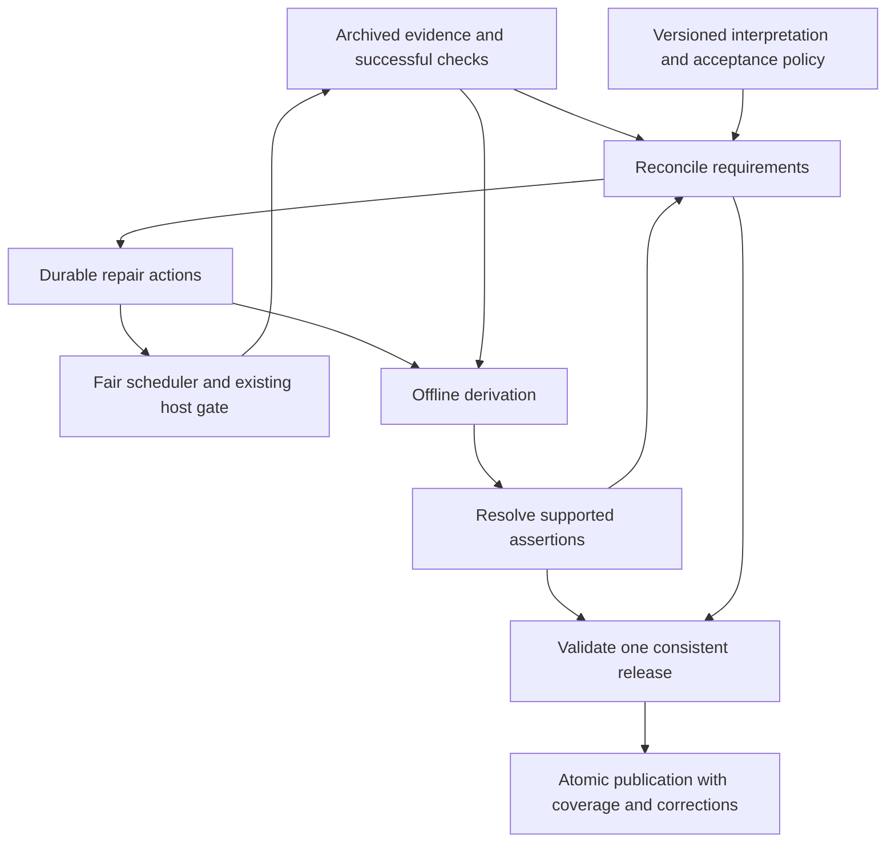

# Self-healing and publication accuracy

Status: proposal, 2026-09-12. Not implemented or an accepted replacement for the
current contracts. Based on the [systemic audit](../research/self-healing-2026-09-12.md).

Reinforced by the [curated-dataset research](../research/curated-datasets-state-of-the-art-2026-09-12.md).
The research adds acceptance of source generations, strict interpretation, durable
negative decisions, deletion authority, and representative accuracy review.
These additions remain proposals; cited precedents establish practices, not a
measured accuracy guarantee for Swingset.

Swingset should continually reconcile its data against explicit requirements for
evidence, freshness, and derivation. A successful job is not proof that its data
meets those requirements. An empty queue is not proof of completeness.

Keep Python, SQLite, the archive, offline transformations, systemd, and atomic
Hub publication. This proposal changes their contracts and coordination. It does
not require a distributed scheduler or another database.

## Guarantees

1. **Recovery:** every known, in-scope unmet requirement has a durable explanation
   and either a scheduled action or a recorded reason automatic repair cannot
   proceed. A failed attempt does not erase the requirement.
2. **Convergence:** when relevant evidence and interpretation rules stop changing,
   supported repairs succeed, storage is recoverable, and scheduled work receives
   capacity, the published result eventually equals a clean rebuild from that
   evidence and those rules. Incremental processing and full rebuilding agree.
3. **Correction:** new contrary evidence can revoke an earlier assertion. All
   affected joins and derived values are reconsidered, including old events.
4. **Publication safety:** default facts meet a versioned acceptance policy at the
   release's evidence cutoff. Unresolved identity hypotheses and contradictory
   claims do not silently become facts through a high matching score.
5. **Visible limits:** unresolved scope, source absence, stale evidence, and
   unsupported interpretation remain distinguishable in published coverage.

Convergence is conditional on obtainable evidence and a working interpreter; it
cannot repair a source that publishes an incorrect fact with no contrary evidence.
Accuracy therefore needs source validation, conservative assertion rules, and
ongoing evaluation as well as eventual consistency. The guarantee applies to the
latest release. Previously downloaded or pinned releases cannot be corrected in
place; each correction needs an attributable new release.

## Proposed flow

Reconciliation runs at startup, periodically, and after relevant changes. It runs
even when ordinary work is pending. Fetching remains the only path to source
sites; reconciliation and derivation inspect local state.

## 1. Evidence: separate checking, content, and interpretation

Deepen the existing fetch/archive/parse write path into an evidence module. Its
interface records a fetch attempt and a successful interpretation, then exposes
the best usable evidence for a watch under a specified interpretation recipe.
It owns the conditions under which freshness may advance.

Keep these concepts separate:

| Fact                                 | Meaning                                                                                                |
| ------------------------------------ | ------------------------------------------------------------------------------------------------------ |
| Last attempted check                 | A request was attempted; errors may update this.                                                       |
| Last successful content verification | The source returned a recognized representation, or validated an intact cached one.                    |
| Content identity                     | Hash of the archived representation; unchanged checks reuse it.                                        |
| Last semantic change                 | The interpreted claims changed.                                                                        |
| Interpretation recipe                | Executable artifact, parser/extractor policy, and relevant dependencies used to interpret the content. |
| Last successful interpretation       | Which content was accepted under which recipe.                                                         |
| Source observation time              | When the source evidence describes the world; historical archive time differs from retrieval time.     |

A usable current reading requires a successful content verification joined to a
successful interpretation of that content under the required recipe. HTTP success
alone is insufficient. A 304 can renew content verification only if its cached
representation exists, passes its hash check, and can be interpreted. A parser
change can invalidate interpretation without forcing another origin request.

An identical successful response renews freshness without replacing historical
claim provenance or relinking every event. Probe advancement and stale-profile
selection use this verification state, not the age of the last semantic change.
An error never renews it. A recognized not-found response is time-bounded negative
evidence, not proof that an identifier never existed or will never exist.

Keep successful check records compact and local. Do not archive another full body
for every identical check. A public freshness summary can update at a bounded
cadence without rewriting all fact tables on every poll.

RFC 9111 grounds freshness renewal for a validated cached representation; parser
acceptance remains a separate Swingset requirement.
See [HTTP validation](https://www.rfc-editor.org/rfc/rfc9111.html#section-4.3.3).

### Accept bounded source generations

Stage the output of a finite source unit, such as one paginated index or round
sheet, with its input manifest, coverage evidence, recipe, and guard results.
Promote it only after its source contract passes. Failed or partial units remain
archived evidence but cannot claim to be complete enumerations.

Deletion by absence requires both an accepted complete enumeration and explicit
source authority for removal within that scope. A failed fetch, missing page, or
run of unused registry numbers does not supply that authority. An older accepted
generation can remain usable with disclosed age only while its assertions retain
support. Known wrong claims must still be revoked.

This adapts the synchronization lesson from
[OpenAlex](https://help.openalex.org/access/sync/); WSDC does not supply the same
snapshot completeness or deletion interface. Source acceptance precedes, and does
not replace, the compatible-generation checks at publication.

## 2. Requirements: make missing data durable and actionable

Add a reconciliation module with one main interface: given a consistent local
view, policy, and time, compute unmet requirements and justified next actions.
Persist the differences transactionally and enqueue idempotent work. Source
adapters declare supported discovery and interpretation capabilities; the
reconciler does not invent URLs or resolve ambiguous identities itself.

Start with the gap classes already measured:

| Requirement                                           | How it is discovered                                                        | Example next action                                                            |
| ----------------------------------------------------- | --------------------------------------------------------------------------- | ------------------------------------------------------------------------------ |
| Listed round has usable observations                  | Supported event page lists a round URL.                                     | Fetch, restore, or reparse that round.                                         |
| Source event has sufficient mapping evidence          | Accepted index/event observation lacks a unique event mapping.              | Read a known metadata page; otherwise request parser or alias review.          |
| Source-asserted WSDC ID has been checked              | An entry carries an ID absent from verified registry state.                 | Direct lookup of that ID within the host budget.                               |
| Recent first-point finalist can be reconsidered       | Eligible results have an unresolved person/registry relationship.           | Probe new IDs and relink when new dancers arrive.                              |
| Registry occurrence has a supported event association | Registry provides a series and month.                                       | Search known local indexes, supported historical discovery, or mapping review. |
| Materialized scope uses current inputs                | Evidence, mapping, policy, or executable recipe changed.                    | Recompute the scope and affected dependents.                                   |
| Published assertion has sufficient support            | A contradiction, expiry, suppression, or policy change invalidates support. | Revoke/recompute before publication.                                           |
| Required archive artifact is usable                   | Parse/build/periodic integrity check finds missing or corrupt bytes.        | Restore by digest; refetch only if the source representation is replaceable.   |

Source adapters also declare what coverage they can substantiate: listed child
URLs, source-provided totals, pagination completion, supported fields, and known
omissions. Validate these against interpreted output where independent checks
exist. An empty parse or a sudden loss of dates must not silently count as complete.
For judge marks, expectations must respect role-specific panels and source
semantics; a round-wide rectangular matrix is not a universal completeness rule.

Make interpretation exhaustive within declared scope: handle each relevant
category or field, deliberately exclude it, or emit an actionable failure.
Critical unknowns block the affected source unit. Give each contract a maintainer,
runbook, and reviewed guard history. Unexpected output must not automatically
lower a quality bound or update an acknowledged source hash. These mechanisms
adapt zavod's [interpretation](https://zavod.opensanctions.org/best_practices/strict_interpretation/)
and [assertion](https://zavod.opensanctions.org/metadata/) practices.

When reliable extraction is unavailable, monitor a stable revision sentinel and
open review for unacknowledged changes. A reviewed local extraction can then be
updated with its supporting source. Keep revision discovery automatic even when
interpretation needs judgment; see zavod's
[change detection](https://zavod.opensanctions.org/best_practices/change_detection/).

Use stable keys such as `(requirement_kind, subject_key, policy_version)` and
record desired input fingerprint, state, first detected time, last progress time,
attempt count, next eligible time, supporting evidence, and blocking reason.
Aggregate shared gaps: one unmapped registry occurrence can explain thousands
of placement joins. Do not create thousands of identical acquisition requests.

States should distinguish `ready`, `retry_wait`, `waiting_for_source`,
`needs_implementation`, `needs_review`, `unavailable`, `out_of_scope`, and
`satisfied`. An active worker is attempt state, not proof of requirement status.
Closing a requirement requires checking its postcondition against current inputs;
a job exiting successfully is insufficient. Input or policy changes can reopen it.

Findings and human review remain useful. Each relevant finding links to a
requirement and proposed remedy; unknown problem classes remain visible for
triage. Review decisions are versioned, evidence-backed inputs. Code changes and
uncertain aliases still require engineering or review; retrying cannot supply
missing interpretation logic.

Incremental reconciliation handles ordinary changes cheaply. A bounded periodic
scan reconciles all supported requirement classes independently of queue history,
with a durable scan cursor and lag measurement. This repairs a missed enqueue or
lost work record. The requirement inventory must also be rebuildable from
evidence, accepted policy, and durable review decisions.

The periodic scan must cover retained history, not just newly discovered or newest
time partitions. Existing orchestration defaults can be narrower; see
[Dagster's documented condition behavior](https://docs.dagster.io/guides/automate/declarative-automation).
Verify old scopes independently of the incremental queue and candidate index.

## 3. Work: fair progress, bounded failures, no forgotten gaps

Keep the single-writer SQLite transaction model. Separate collection admission
from derivation backlog: each cycle budgets time for reconciliation, acquisition,
and offline work. A broken parse must not indefinitely prevent unrelated fetches.
Use backpressure to bound archived-but-unprocessed bytes and work counts, while
reserving a small acquisition allowance for repairs needed to unblock work.

Within each host's existing polite request and byte limits, reserve shares for
newly discovered pages, current-event refresh, identity confirmation, and old
evidence refresh. Allow unused shares to be borrowed. Add age promotion and a
maximum service-gap objective for each eligible class. Set shares from measured
load in shadow operation; do not raise host limits to compensate for wasted work.
Global cycle time also needs fair allocation across hosts and work classes.

Date-less pages receive a bounded metadata-recovery policy, not indefinite live
event polling. Gone/unpublished pages move to infrequent rechecks or an explicit
unavailable state with a future trigger. New parent links can reactivate them.

Transient errors use bounded exponential backoff and host cooldowns. Repeated
deterministic parser failures under identical bytes and recipe stop immediate
retries, retain their unmet requirement, and wait for a relevant change or review.
An unrecoverable work item is isolated with its evidence and failure reason;
unrelated scopes continue. Artifact recovery tries a verified local/backup copy
before refetching. A historical artifact without a recoverable copy is explicitly
unavailable; current source bytes cannot impersonate its historical contents.

Work completion uses the input generation it actually processed. If desired inputs
changed during an attempt, an old completion cannot mark the new requirement
satisfied or delete its newer work. Retain atomic output/downstream-work writes,
idempotent actions, restart recovery, and existing publication receipts.

New-number discovery remains continuous throughout the year. Keep intensive
post-event confirmation and slower ongoing reconciliation after the intensive
window. Check explicit source IDs directly. Do not interpret 20 frontier misses
as proof that no larger number exists: revisit the frontier, recheck holes on a
bounded schedule, and use supported enumeration or verified higher-ID evidence
when available. Coverage must state the searched range and time, including that
an unbounded registry namespace has no established completeness denominator.

## 4. Derivation: reproducible recipes and complete invalidation

Keep the existing project/link separation, but make every materialized scope
record its input fingerprint and executable recipe. Reconciliation compares
desired and materialized fingerprints; the work queue becomes an execution aid,
not the only memory of what must be recomputed.

Compute recipe identity from the built runtime artifact and captured policy,
schema, configuration, and dependency inputs. Explicit human version numbers
remain useful labels, but forgetting a version bump must not leave old results
active. Start with conservative replay on a changed runtime artifact. Narrow
invalidation to separately fingerprinted modules only once dependency declarations
and clean-rebuild comparisons prove that optimization safe.

Record dependency sets at scope granularity: source events to canonical events,
registry evidence and candidates to identity assertions, assertions to derived
joins, and all of these to releases. Include removed and previous mappings.
Candidate indexes are an optimization, not the complete dependency set: a newly
seen dancer must reconsider previously unmatched entries even if no candidate
relationship existed before. Retain broad relinking as the safe fallback.

New evidence can reduce certainty. A contradicted ID must invalidate derived
points and participation joins; a corrected alias must remove obsolete mappings.
Retained evidence grows, but accepted assertions need not grow monotonically.

## 5. Accuracy: resolve assertions before populating default joins

Deepen identity acceptance into a resolution module whose interface returns
accepted assertions, unresolved hypotheses, and contradictions with their evidence
and policy version. Candidate generation and scoring remain internal operations.
An assertion can be accepted, revoked, or superseded; record why and when.

Store positive, negative, and insufficient-evidence review decisions against
stable source subjects and the evidence fingerprint they concern. An unrelated
replay must not resurrect a rejected pair. Material new evidence can reopen a
decision through an explicit supersession, preserving its history. Source-subject
anchors must survive event remapping or receive a recorded migration. This adapts
the durable decision model in [nomenklatura](https://github.com/opensanctions/nomenklatura/blob/main/README.md)
and the correction memory illustrated by [Wikidata](https://www.wikidata.org/wiki/Help:Ranking).

For consequential assertions, retain all material support and contradictions,
not just a winning snapshot. Separate the time a claim concerns, when its evidence
was observed, and when Swingset accepted or revoked it. Do not substitute retrieval
time for an unknown historical effective date. These are relational records;
adopting the [PROV concepts](https://www.w3.org/TR/prov-dm/) does not require RDF.

Distinguish “the results source printed ID X,” “the registry recognizes ID X,”
and “the evidence supports this entrant being person X.” These are different
claims. A registry lookup that finds an ID alone does not verify the entrant.
Source mistakes, reused bibs, paired names, and contradictory role/placement
evidence must be considered before accepting the identity join.

Proposed publication policy:

- Keep direct source facts with their provenance and interpretation status.
- Populate default person-ID joins only when the versioned acceptance policy has
  sufficient evidence and no unresolved disqualifying contradiction.
- Keep uncertain matches in explicitly named hypothesis tables; leave default
  person-ID columns null. Do not require every consumer to remember a status filter.
- Preserve raw source IDs separately from accepted IDs, including rejected or
  unverified claims and their reasons.
- Model unavailable signals as unavailable. A judge's unknown dance role is not
  a role mismatch; an unrestricted division is not a low skill level.
- Treat current heuristic scores as ranking scores, not calibrated probabilities.
  Do not automatically promote them to factual joins solely by threshold.

This is a deliberate schema/policy change from publishing `probable` IDs in the
main tables. It may reduce linked coverage initially. That reduction exposes
existing uncertainty and prevents unsupported links from contaminating analyses.
Names need no fabricated person ID merely to retain results and judge marks.

During migration, withhold known-invalid identity cohorts as soon as they are
identified. Run new acceptance rules against stored evidence in shadow mode
before expanding accepted joins. Fixing the judge score ceiling is not, by itself,
evidence that the newly higher-scoring identities are correct.

Maintain a reviewed identity evaluation set covering judges, common names,
unrestricted divisions, role switching, paired names, first-point dancers, and
historical events. Validate source-provided labels before treating them as truth.
Separate training/tuning and evaluation across people and events to reduce
leakage. Report false accepted links and abstentions by cohort, with sample sizes
and uncertainty; do not pick a claimed precision target without enough evidence.
Monitor input-shape and cohort shifts after deployment.

Maintain three distinct review streams: representative accepted-link samples,
unresolved-entry samples that can expose missing candidates, and enriched known
failure cases. Record sampling design and uncertainty; a difficult-case set does
not estimate population precision. Review-budget methodology remains an active
research topic; the [2026 stratified-review preprint](https://arxiv.org/abs/2608.01401v1)
supports explicit tradeoffs rather than a universal sampling prescription.

Model-assisted review or extraction changes should first produce proposals with
stored evidence and abstention. Expanding automatic acceptance requires Swingset
evaluation, not transfer of a benchmark score from another domain. A successful
model call is not an assertion acceptance condition.

Apply independent accuracy checks to parsing and event mapping as well: review
samples against archived source pages, compare independently obtained result
totals where available, and retain counterexample fixtures. A clean rebuild can
repeat the same parser bug, so rebuild equivalence alone cannot certify accuracy.

## 6. Publication: coherent evidence, safe defaults, visible degradation

Preserve atomic publication and immutable candidates. Add a release validator
that checks evidence support and required generations, as well as hashes, schema,
referential integrity, and point consistency.

A release pins an evidence cutoff, interpretation/acceptance recipe, selected scope
generations, and coverage inventory. Every join must resolve against compatible
selected generations. New evidence arriving after the cutoff belongs to the next
release. Unrelated continuous collection need not prevent a coherent release.

Initially retain a conservative barrier for affected derivations while allowing
collection to continue. Introduce partial-scope releases only after dependency
closure checks exist. Never remove the global barrier without its replacement:
otherwise an old link can be published against a new event or dancer generation.
An alias move includes both old and new scopes in one consistency group.

For a blocked scope, retain prior facts only if their support remains admissible
under the release policy. Mark allowed stale evidence with its actual age. If
support is revoked, null the affected assertions or exclude the unsupported scope
and dependent rows, preserving referential integrity and recording the omission.
A last-good copy is not an acceptable fallback for a known wrong identity.

Publish coverage and freshness as data, not just prose in the card. For each
supported source/year/event scope, distinguish discovered, acquired, interpreted,
mapped, resolved, withheld, and unavailable evidence. State denominators; an
unknown discovery universe is not 100% coverage. Include scope status and evidence
time on commonly used tables so an omitted join and a stale fact are visible.

Coverage regressions require an explanation, not a universal row-count gate:
legitimate retractions and corrections can reduce rows. Reject unsupported
assertions and inconsistent releases, while permitting disclosed incomplete
coverage. Publish assertion revocations in the changelog. Update health/freshness
at a bounded cadence and at material status changes even if fact bytes are quiet;
this explicitly changes the current quiet-publication rule.

Represent each quality result with a metric, population, method, evidence cutoff,
and uncertainty where estimated. Keep acquisition, interpretation, linkage, and
reviewed accuracy separate. The [W3C Data Quality Vocabulary](https://www.w3.org/TR/vocab-dqv/)
provides conceptual guidance; these measurements can be ordinary Parquet tables.

## Acceptance and rollout

Implement as small revisions, each with a useful standalone outcome:

| Revision | Change                                                                        | Acceptance                                                                                                                                                           |
| -------- | ----------------------------------------------------------------------------- | -------------------------------------------------------------------------------------------------------------------------------------------------------------------- |
| 1        | Verification freshness and immediate registry/judge/division/name corrections | Identical not-found probes advance; unchanged profile refresh rotates; existing identity counterexamples cannot become accepted joins.                               |
| 2        | Requirements and periodic reconciliation in shadow mode                       | Rebuild the audit's supported gap counts; deleting a synthetic work item causes it to be recreated; explanations agree with captured evidence.                       |
| 3        | Fair scheduling, backpressure, and failed-work isolation                      | Sustained live polling leaves reserved progress for new pages; a permanently failing parse cannot block unrelated acquisition or derivation.                         |
| 4        | Recipe fingerprints and desired/materialized generations                      | A code change without a manual version bump replays affected output; superseded work cannot clear newer requirements.                                                |
| 5        | Assertion acceptance and safe publication schema                              | Contradictory identity evidence revokes a join and dependent values; uncertain hypotheses remain queryable separately; reviewed evaluation detects false acceptance. |
| 6        | Release consistency and public coverage                                       | No selected join crosses incompatible generations; incomplete scopes are disclosed; corrected releases preserve an attributable history.                             |
| 7        | Operational convergence checks and staged activation                          | Replay under crash/retry/reordering schedules equals a clean rebuild; alerts detect unmet requirements with no progress; restore resumes outstanding repairs.        |

Revision 1 should itself be split into freshness, judge scoring, unrestricted
division, and paired-name changes. Revision 2 can run beside those fixes because
it initially schedules nothing. Activate automatic repair by requirement class,
observe load within existing host caps, then extend historical discovery through
the separate [backfill plan](backfill.md).

Insert source contracts and bounded-generation acceptance before broad repair
activation. Introduce durable negative decisions before expanding identity
acceptance. Specific additional acceptance cases: a missing pagination page cannot
authorize deletion; a rejected pair stays excluded after unrelated replay; an
unacknowledged source revision opens review; and a representative accepted-link
audit remains distinct from the regression corpus.

Exercise the whole module interfaces with a fake clock and source adapters. Test
late-issued IDs beyond 30 days, restored not-found IDs, unchanged 200/304 results,
source corrections/removals, conflicting source IDs, lost enqueue records,
corrupt artifacts, crashes around transactions/publication, recipe changes, and
continuous high-priority demand. State-machine tests should vary ordering and
failures; clean-rebuild comparison checks final semantic output, not incidental
run timestamps. Publication history has separate correction/receipt checks.

Measure requirement age, time since last progress, acquisition/derivation lag,
oldest successful verification, unresolved contradictions, retry reasons, and
accepted-link precision from reviewed samples. A timer heartbeat or successful
HTTP count cannot substitute for these measures. A no-progress alert includes
the blocked requirement, last attempted remedy, and next permissible action.

## Contract changes on acceptance

This proposal does not silently override existing owners. Implementation revisions
must update [architecture](architecture.md), [state](state.md),
[fetching](fetching.md), [scheduling](scheduling.md), [parsing](parsing.md),
[identity linking](identity-linking.md), [data model](data-model.md),
[build](build.md), [publishing](publishing.md), and [operations](operations.md)
for their respective behavior. The main intentional changes are successful-check
freshness, independent reconciliation, failure isolation, executable invalidation,
stricter published identity joins, and release validation with coverage metadata.
