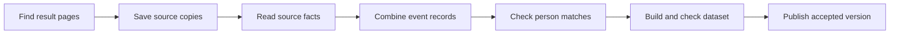

# How a result reaches the dataset

Swingset keeps the evidence from a source separate from its interpretation of
that evidence. This lets it fix a parser, correct an event match, or withdraw a
person match without fetching every page again.

## Follow one result

Use the fictional “Autumn Swing 2026” result from the [overview](../overview.md).

1. **Find and save the page.** A calendar or source index points to the event.
   Swingset schedules a request and keeps the response as a _snapshot_.
   [Read about collection](collection.md).
2. **Read what it says.** A source-specific parser reads bib 42's result.
   This source statement is an _observation_. Swingset then combines related
   observations into shared event and contest records, called _canonical rows_.
   [Read about interpretation](interpretation.md).
3. **Check who it refers to.** Bib 42 belongs to this event. A WSDC number
   identifies a registry dancer. Linking needs evidence that connects the two.
   [Read about identity](identity.md).
4. **Check and publish.** Swingset prepares a complete proposed dataset, called
   a _candidate_. It checks that the records and their evidence agree before
   publishing. [Read about publication](publication.md).

## What happens when something changes?

A changed result, parser, or reviewed correction can make later work out of
date. Swingset records unfinished work so it can rebuild affected results and
recover after interruptions. Some automatic repair work remains planned.
[Recovery](recovery.md) explains the approach; [status](../status.md) records
what has actually been accepted and deployed.

For implementation, use the [code map](code-map.md). For exact terms and rules,
use the [glossary](../reference/glossary.md) and [reference index](../reference/README.md).
