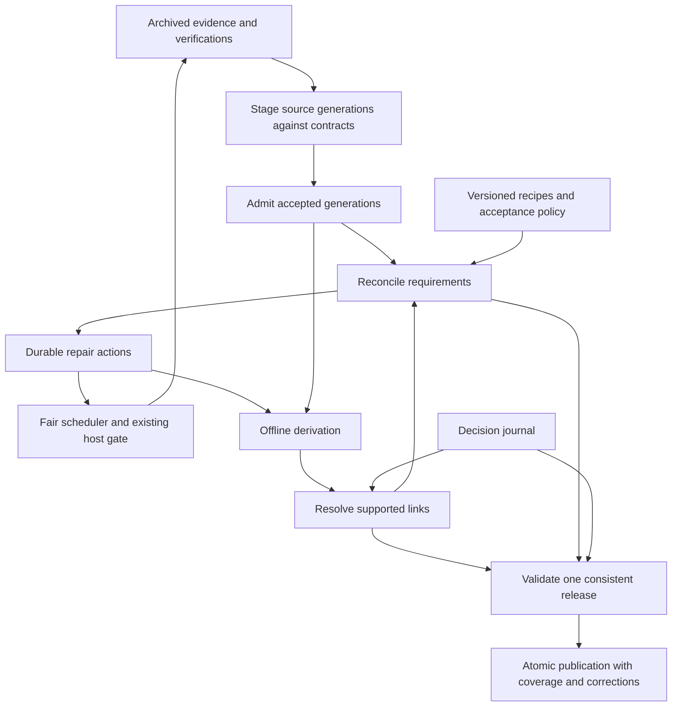

# Recovery and publication guarantees

This contract describes how Swingset checks source evidence, preserves
corrections, and recovers unfinished work. Start with
[recovery explained](../how-it-works/recovery.md) for the main ideas.

The contract was recorded as accepted for implementation on 2026-09-12.
Parts have since been implemented and deployed; event-completion follow-up
and automatic repair activation remain pending. Use [current status](../status.md)
for evidence and the [rollout](../plans/recovery/README.md) for acceptance gates.
The presence of a rule here does not establish that every part is running.

The recovery work extends the existing worker, archive, database, and scheduler.
It does not introduce a second scheduler or database. Source admission and
lasting correction records must precede broad automatic repair; retries alone
can repeat a bad interpretation or restore a rejected identity.

## Choose a question

| Question                                                 | Detailed contract                        |
| -------------------------------------------------------- | ---------------------------------------- |
| Recovery vocabulary and existing records                 | [terms](recovery/terms.md)               |
| Checking whether source evidence is current              | [verification](recovery/verification.md) |
| Checking a source interpretation before accepting it     | [admission](recovery/admission.md)       |
| Recording gaps and the work they need                    | [requirements](recovery/requirements.md) |
| Isolating work and sharing time fairly                   | [work](recovery/work.md)                 |
| Tracking inputs and rebuilding affected results          | [derivation](recovery/derivation.md)     |
| Preserving reviewed identity decisions                   | [identity](recovery/identity.md)         |
| Publishing a dataset with consistent supporting evidence | [publication](recovery/publication.md)   |
| Pausing work and explaining progress                     | [controls](recovery/controls.md)         |

The original contract was based on the [missing-data investigation](../../journal/investigations/2026/self-healing-2026-09-12.md)
and [curated-dataset research](../../journal/investigations/2026/curated-datasets-state-of-the-art-2026-09-12.md).

## Guarantees

1. **Recovery:** every known, in-scope unmet requirement has a durable
   explanation and either a scheduled action or a recorded reason automatic
   repair cannot proceed. A failed attempt does not erase the requirement.
2. **Convergence:** when relevant evidence and recipes stop changing, supported
   repairs succeed, storage is recoverable, and scheduled work receives
   capacity, the published result eventually equals a clean rebuild from that
   evidence and those recipes. Incremental processing and full rebuilding agree.
3. **Correction:** new contrary evidence can revoke an earlier link. All
   affected joins and derived values are reconsidered, including old events.
4. **Publication safety:** default facts meet a versioned acceptance policy at
   the release's evidence cutoff. Unresolved candidates and contradictory claims
   do not become facts through a high matching score.
5. **Visible limits:** unresolved scope, source absence, stale evidence, and
   unsupported interpretation remain distinguishable in published coverage.
6. **Operator control:** collection and repair can be paused by host, source,
   or requirement kind, then resumed from durable checkpoints. Restart does not
   clear a pause, discard work, reset budgets, or start the backfill over.
7. **Trackable progress:** `swingset doctor` explains what has completed, what
   remains, what is blocked or paused, and what has reached publication.

**Completion rule.** A requirement closes only when its postcondition is checked
against current inputs under the current recipe. Nothing closes it by
succeeding: not an HTTP 2xx or 304, a job exit code, a row count, a valid
foreign key, a heartbeat, a request rate, a model call, or a higher linked-row
count. The same rule governs progress reports, activation gates, and release
validation. Later sections rely on this rule and do not repeat it.

Convergence is conditional on obtainable evidence and a working interpreter; it
cannot repair a source that publishes an incorrect fact with no contrary
evidence. Accuracy therefore also needs source validation, conservative link
acceptance, and ongoing evaluation. The guarantee applies to the latest release.
Downloaded or pinned releases cannot be corrected in place; each correction
needs an attributable new release.

## Proposed flow

Reconciliation runs at startup, periodically, and after relevant changes. It
runs even when ordinary work is pending. Fetching remains the only path to
source sites; reconciliation and derivation inspect local state.

## Contract changes on acceptance

This proposal does not silently override existing owners. Each rollout revision
updates its owning contracts in the same change: [glossary](glossary.md),
[architecture](architecture.md), [state](state.md), [fetching](fetching.md),
[scheduling](scheduling.md), [parsing](parsing.md),
[identity linking](identity-linking.md), [data model](data-model.md),
[build](build.md), [publishing](publishing.md), and
[operations](operations.md). The [rollout](../plans/recovery/README.md) lists which
revision changes which contract.
