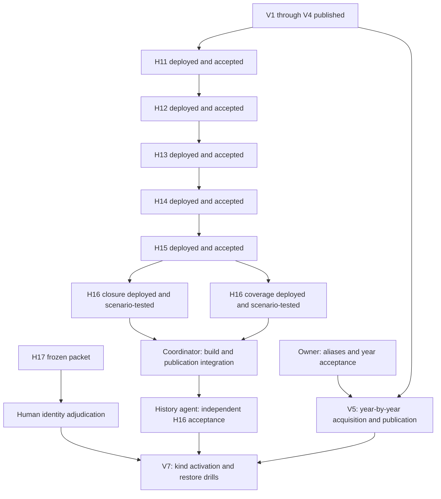

# v2 implementation evidence

> Historical record. Dates, status claims, and instructions below describe the
> original work. See [current status](../../docs/status.md) before acting.
> [Project journal](../README.md)

Status: V1 complete at public commit
`7cfcf4ec5dbc994d91f3e4d816f43b3abe16637b`. V3 is complete at public commit
`4653f3a3a6076d3af474c28f7bd0e93998ca0a9c`, 2026-09-13 UTC. V2 and V4
are complete at `81121dcc7d62a1db9e76ee1c49a6b90e1f4c5653`.
V5 infrastructure and V6 are in progress. Scheduled workers remain held.
The [accepted plan](../../docs/plans/history-and-recovery.md) owns the gates.

The owner paused production steps after the current scratch build on
2026-09-15 UTC, intending to resume with a stronger network connection.
The new 2d5 source passes 1,199 frozen tests, lint, type checks and Nix build;
all 34,986 scratch scopes are current and independent verification passed.
Its full build stayed within memory limits but again exceeded the 45-second
completion deadline during final closure certification and rolled back.
The isolated 38.82-second diagnostic did not establish enough margin for the
full build. No accepted build, substantive candidate audit, deployment,
production initialization or publication followed. Work is paused after
retaining the failure evidence; the remaining blocker is local computation.
[Resume notes](../investigations/2026/2026-09-15-release-handoff.md) preserve the handoff.

## Work graph

Three subagents share one working copy. The coordinating agent owns migration
ordering, projection/build integration, coverage, cross-module tests, and final
review. File ownership is handed off explicitly.



H11 and H17 use the plan's explicit early-start exceptions. They enable no
automatic repairs or new default identity joins.

## Local implementation

| Scope      | Local change                                                                                                                                                                  | Acceptance still needed                                                                                                      |
| ---------- | ----------------------------------------------------------------------------------------------------------------------------------------------------------------------------- | ---------------------------------------------------------------------------------------------------------------------------- |
| H1, H2     | Verification separated from claim provenance; unchanged and 304 checks; conservative recovery; finite probe advancement; stale-profile rotation; bounded failed-probe retries | Deployed; G1 passed and its source pause cleared. Scheduled workers remain held with publication.                            |
| H3, H4, H5 | Unavailable judge-role evidence excluded from scoring; unrestricted divisions do not imply low skill; paired names abstain; probable decisions do not populate default IDs    | Complete: owner approved H3; reviewed V1 correction published                                                                |
| WP11       | CDX paging and selection, gated archive transport, capture-time precedence, sealed watches                                                                                    | Complete: real EEPro 2019 index accepted under the host budget                                                               |
| WP12       | Registry occurrence inventory, nullable dates, conservative series aliases and month matching, explicit year acceptance, published coverage schema                            | V2 published: all 1,888 occurrences mapped once; owner year acceptance remains for V5                                        |
| WP13       | Council, legacy calendar and newsletter captures replayed; reviewed empty newsletter bodies pinned by hash                                                                    | Seventeen captures await the next daily budget; source warnings and aliases remain                                           |
| H8, H9     | Append-only decision journal, durable source references, conservative invalidation and shared decision resolution                                                             | Complete: scenario tests, checkpoint recovery and V3 publication verified                                                    |
| H6, H7     | Immutable admission reports, reviewed contract activation and atomic generation selection                                                                                     | Complete: nine reviewed contracts enforced and V4 published                                                                  |
| H11        | Rebuildable shadow inventory, durable transitions and cohorts, offline doctor reporting                                                                                       | Complete: schema10 deployed; full retained inventory and fresh-process checks passed                                         |
| H12        | Durable unit attempts, retry gates, checkpoint artifact recovery and per-scope cycle isolation                                                                                | Complete: schema11 deployed; migration, protected-state and restart checks passed                                            |
| H13        | Durable source/kind/all controls, bounded admissions, publication draining and shared execution dependencies                                                                  | Complete: schema12 deployed; 898 tests and live pause/restart/restore-specimen acceptance passed                             |
| H14        | Shared host allocation, fair offline stages, bounded watch recovery and measured scheduler reporting                                                                          | Complete: schema13 deployed; 989 tests and protected-state/fresh-process acceptance passed                                   |
| H15        | Captured runtime recipes, immutable derivation output and dependencies, stale completion fences and work discovery                                                            | Complete: schema14 deployed; 1,040 tests covered and protected-state/fresh-process acceptance passed                         |
| H16        | Selected release closure and coverage/freshness inventories                                                                                                                   | Deployed; follow-up passes 1,199 frozen-source tests and full scratch replay; build and production release acceptance remain |
| WP14       | Step Right index, event and round adapters; legacy marks and anonymous judge columns                                                                                          | Real fixture review, contract admission, accepted years and historical acquisition remain                                    |
| WP15       | Retained archive planning, exact source-kind gates, bounded fallback and ordinary-cycle dispatch                                                                              | Owner year acceptance and operational acquisition remain gated                                                               |
| WP16       | Archive-first origin planning, request-time parent checks, durable event limits and event-site review suggestions; schema15 migration helper                                  | Frozen package built; 1,396 tests passed. Deployment, real DCN/score-PDF parsers and fixtures, and year gates remain         |
| H17        | Reproducible sampling and externally supplied adjudication                                                                                                                    | Human review of representative accepted/unresolved samples                                                                   |

H8/H9 now pass the journal, reference migration, exact source ownership and
checkpoint scenarios. H10's correction-only rehearsal removes 1,756 unsupported
default entry joins while preserving raw source facts and every queued work unit;
all 24 independent acceptance checks pass. See the
[V3 receipt](../investigations/2026/v3-correction-2026-09-13.md).

The [contract4 engineering review](../investigations/2026/h6-contract4-review-2026-09-13.md)
checks the frozen H6 corpus. Enforced production replay and all 57 combined
V2/V4 acceptance checks passed. No phase2 history watches or repair kinds have
been activated. V1, V2, V3 and V4 are published.

## Retained acceptance evidence

The owner approved the [H3 retained-evidence packet](../investigations/2026/judge-acceptance-2026-09-13.md)
on 2026-09-13 UTC. It compares three supported judge candidates against three
near-name candidates using retained scoring headers, independently printed
entrant IDs, and registry bodies. The audited and live baseline judge IDs are
all null. V1 therefore requires removal of the audit's two wrong paired-name
dancer joins and preservation of withheld judge IDs. Some judges have no WSDC
number; their named records remain valid with a null ID.

The correction replay used a disposable copy of the verified G1 checkpoint
without source requests. Projection produced 2,240 events. The unrestricted
candidate passed the integrity audit; the published correction then withheld
all 251 new or changed default joins. Its full receipt appears below.

The event-list research retained CDX results and metadata but deleted the HTML
and PDF bodies after inspection. Two phase 1 bodies were recovered through the
project's fetch gate on 2026-09-13 UTC and retained as fixtures. The council
capture from `20120825221508` contains 97 listings, including 10 month-only
dates. Newsletter Volume 6 contains 37 sidebar listings and four dated
approval notices. The actual layout exposed parser defects that the synthetic
tests missed; both are now regression fixtures. Other layouts and newsletter
trial-event colors still need review.

## G1 operating receipt

Read-only inspection on 2026-09-13 UTC found the live writer still using schema
1, already in post-sweep probing. Its probe cursor was `29029`, the probe
started at `2026-09-12T14:00:07.372556+00:00`, and the retained sweep bounds
were dump `28998` and local `29028`. The plan's earlier cursor `3297` is a
historical observation, not the current cursor.

The plan's G1 fallback was applied with the installed CLI:

```sh
orb -m swingset sudo -u swingset swingset pause --source wsdc_registry \
  --reason 'implementation-plan-v2 G1 fallback: sweep completed before H1/H2 deployment; hold until fixed probe verification' \
  --lock-timeout 60
```

Read-only verification at `2026-09-13T03:46:05.542443+00:00` confirmed that
source pause, without an expiration. The public commit then observed was
`87960f6936e0b887a2bc115ae5e01860b9d62094`. Scheduled v1 work continued before
the deployment hold; the baseline at that hold was
`997945b6bd8c48b950faa397051aa892f53d7935`.

The authorized deployment then completed the G1 fallback:

| Evidence          | Observed result                                                                                                |
| ----------------- | -------------------------------------------------------------------------------------------------------------- |
| Schema migration  | 1 to 5 in 11.249 seconds; 29,059 historical checks recovered; no foreign-key errors                            |
| Controlled run    | `run_20260913T042608Z`                                                                                         |
| Requests          | One robots GET at `04:26:08.512053` UTC, then one lookup POST at `04:26:13.525022` UTC                         |
| Lookup            | ID 29029; HTTP 404; recognized identical not-found body                                                        |
| New usable check  | `2026-09-13T04:26:13.703924+00:00`, after the probe's original start                                           |
| Cursor and misses | 29029 to 29030; 0 to 1; confirmed in before/after doctor JSON                                                  |
| Body SHA-256      | `8437bd0ef46a19c9a7c294c53e0429b40e76ebbd5fe9fd73a9025752495ddb1c`                                             |
| Interpretation    | Original `snap_20260912T130902Z_8437bd0ef46a`; extract 2, parser 3                                             |
| Claim evidence    | Snapshot rows, observation rows, and current interpretation pointer unchanged                                  |
| Pending work      | Same five pre-existing parse items; no new parse work or candidate                                             |
| Public head       | Read-only remote check at `04:27:13.650847` UTC confirmed unchanged `997945b6bd8c48b950faa397051aa892f53d7935` |

The controlled script restored the original source pause in its `finally`
block. After doctor confirmed success, the installed CLI cleared only that
G1 source pause. The persistent `/var/lib/swingset/operator-hold` remains;
cycle, backup, and summary timers are stopped. All three services were also
explicitly started to test the installed guard: each stayed inactive with
`ConditionResult=no`, after all temporary runtime guards had been removed.
The guard survives reboot. No v2 dataset was built or published.

Full before/after doctor output, the probe script, request times, migration
receipt, and service checks are retained on the writer under
`/var/lib/swingset/operations/v2-g1-20260913/`.

## Verification

The initial unmodified runtime suite passed 248 tests. Final integrated
verification on 2026-09-13 UTC passed:

- `mise run fmt`.
- `nix develop --command uv run ruff check .`.
- `nix develop --command uv run mypy`: 91 source files.
- `nix develop --command uv run pytest -q`: 358 tests, 31.99 seconds.

The suite covers real v1 migration, interrupted migration rollback,
checkpoint schema validation, pause survival, finite unchanged probes,
identity safety, archived event precedence, capture fallback and redirect
reuse, retained warnings, CDX refresh, immutable cohorts, report recovery,
and build/publication crash recovery. The test suite uses fixtures or fake
transports. Two bounded phase 1 captures supplied the real fixtures described
above; no historical score sheets were fetched. The controlled G1 lookup is
the separate live evidence recorded above.

## Deployed runtime and recovery

The G1 NixOS generation was:

```text
/nix/store/bcxy808d7a8060y6d5sw186dlgsybfb0-nixos-system-swingset-lxc-25.11.20260630.b6018f8
```

Its source is `/nix/store/pi73kr3miagbb350dmjw6kl3y9li52rg-source`, an
uncommitted, content-addressed checkout. The packaged Linux CLI and all 25
locked runtime dependencies were first checked in a separate environment
with a disposable state directory and no source requests. Deployment added
the persistent service hold and a migration performance repair.

The first migration attempt exposed a whole observations-table scan for each
registry snapshot. SIGINT rolled that migration back to schema 1. Recovery
and parse completion now constrain their queries by watch and snapshot,
using existing indexes. A query-plan regression checks both paths. The
successful migration preserved the original observation and check times.

The pre-migration local checkpoint is
`/var/lib/swingset/checkpoints/v2-pre-deploy-20260913T0417Z`. Verification
checked all 62,699 files, 1,511,008,559 bytes, SQLite integrity, schema, and
artifact closure. Its manifest SHA-256 is
`8bfc8a73b25e928e730419601a8b01e5697aec720eb224a6e54f32102f4dc7a0`.
It contains schema 1 and baseline candidate `cand_da0b70418799489c`, with no
pending candidate. Use it only for an intentional complete rollback;
the old runtime must not open the migrated schema 5 database.

The post-check checkpoint is
`/var/lib/swingset/checkpoints/v2-g1-verified-20260913T0428Z`. It preserves
schema 5, the G1 verification, the cleared source pause, the persistent
service hold, and the operating receipts. Verification checked all 62,713
files, 1,687,236,246 bytes, database integrity, and artifact closure. Its
manifest SHA-256 is
`8af07fa6504976293bffe5aab4e8e5f3a1e3f160513677b9dd0d4e2e00334d2e`.
Both checkpoints are local; this deployment uploaded no backup or dataset.

Correction publication is still required before V1 closes. H3 review is
complete. H17 representative human adjudication is a separate gate.

## Retained-state performance

[H11 measurements](../investigations/2026/h11-retained-inventory-2026-09-13.md) cover
109,049 scopes in 1,091 pages. The first inventory scan took 9.64 seconds and
the second 4.58 seconds; doctor took under one second. Schema 6 adds query
indexes and restarts the rebuildable scan cursor without deleting its history.
Schema 7 indexes foreign-key children: migration took 1.41 seconds on the
retained copy, and a rolled-back deletion test preserved all rows and foreign
keys. Both migrations were deployed on 2026-09-13 UTC under the persistent service
hold. The production replay is still draining; this does not mark V1 complete.

The full correction projection exposed those missing indexes. Interrupted
units rolled back, and the replay completed after indexing. Observation type
hint caching preserves decoded objects; a retained 6,375-cell sheet decoded
2.73 times faster. Linker surname pools preserve all candidate fields and
ordering; the largest retained event's 1,217 candidate edges were identical,
with candidate generation 2.60 times faster. These component timings do not
claim an equivalent speedup for the whole pipeline.

## V1 correction deployment in progress

The second runtime generation is
`/nix/store/2qdj7i1znlppfv2ldnarrfjcaxvg3532-nixos-system-swingset-lxc-25.11.20260630.b6018f8`,
with pinned source `/nix/store/zl9b6h0w5qssiyixb9l10xszw2yg3yn3-source`.
It passed 448 tests, Ruff, and mypy over 103 source files. All three services
remain inactive with `ConditionResult=no`, and their timers are stopped.
Production migrated to schema 7 and began offline parse/project/link replay
at `2026-09-13T05:23:23.914108+00:00`. Per-stage timing is retained in
`/var/lib/swingset/operations/v2-v1-correction-20260913/replay.json`.

The disposable candidate `cand_fb0ee969809a4d12` passed the independent schema,
hash, key, reference, and supported-identity audit. It is not approved for
publication: the separate baseline comparison found 251 added or changed entry
IDs. The V1 restriction must withhold them before release. The actual mixed-name
prelim entries retain their original source rows as couple entries without an
individual ID; no finals placement is asserted for either row.

Concurrent H17 sampling and candidate construction exceeded VM memory. The
incomplete candidate was never published. Serial candidate construction
completed; memory-heavy review and build steps are now scheduled separately.
The [H17 packet report](../investigations/2026/h17-review-packet-2026-09-13.md) records a
frozen pre-release local population and its missing held-out cohort. Human
adjudication is pending and no public precision estimate is available.

## V1 complete: reviewed correction published

The exact candidate `cand_6627a6c9aa324e34` published at
`2026-09-13T05:43:31.765426+00:00`, public commit
`7cfcf4ec5dbc994d91f3e4d816f43b3abe16637b`, parent
`997945b6bd8c48b950faa397051aa892f53d7935`.
The publication boundary reproduced that candidate from unchanged inputs,
then verified its remote manifest and all file hashes before promoting the
local baseline. Manifest SHA-256:
`0d8083b4b149475c63325a3632a036af963e08ad6e62f6dfec5b509a1f4119a6`.

The [acceptance audit](../investigations/2026/v1-correction-2026-09-13.md) passed all 27
checks. The independent integrity audit also passed. The release retains
36,715 supported baseline entry joins, withholds all 251 added or changed
joins, preserves both paired-name source rows and their 12 raw marks, and
keeps all 4,919 judge IDs null. Candidate evidence remains available. The
owner-approved H3 packet and the recorded live G1 fallback complete the
remaining V1 scenarios.

The V1 runtime was
`/nix/store/cxxxc0dj6r503rcky2aga6k9324kfh93-nixos-system-swingset-lxc-25.11.20260630.b6018f8`,
source `/nix/store/k6q1zz4w1bh8kfrbvv7bv2b7immjxl6c-source`. It adds only
the tested V1 baseline restriction and release driver to the preceding pinned
runtime; active V2 parser edits were excluded. The restriction and builder
checks passed 30 tests after the preceding 448-test suite.

Production replay took 9.71 seconds to parse, 290.51 seconds to project,
342.13 seconds to link, and 77.80 seconds for the initial build. Reviewed
publication took 3 minutes 1.45 seconds, with 3.8 GB peak memory. Its script,
boundary-build receipt, audits and publication receipt are retained under
`/var/lib/swingset/operations/v2-v1-correction-20260913/`.

The service hold remains mandatory: the special V1 release driver restricts
this release; ordinary scheduled publication has not been resumed. V3 H8/H9
and V4 H6/H7 started only after the verified V1 publication. No phase 2 watch
or repair kind has been activated.

The published V1 state was checkpointed at
`/var/lib/swingset/checkpoints/v2-v1-published-20260913T0543Z`. All 62,726
files, SQLite integrity, foreign keys, and referenced artifacts passed
verification. Its manifest SHA256 is
`0cc3b9c75f00378598f15e8d4a4898f1f401f1855bccdc3fa8c84da3e449c135`.
The private archive upload finished at 06:05:37 UTC with commit
`d812aa6fb04f3ac2aa4b4596414262c2c5902395`; the receipt is
`operations/v2-v1-correction-20260913/backup.json` in production state.
This verifies the checkpoint and upload; the later restore drill with
outstanding repairs remains a separate gate.

## Phase 1 intake and transport acceptance

The owner’s manual Archive terms review preceded bulk intake. The initial
152 archive targets, newsletter index, and 28 distinct newsletter issues were
fetched or reused. Fifteen bounded recent-year CDX queries discovered 32
additional calendar captures. Fifteen of those were fetched before the
archive gate stopped at 200 requests for 2026-09-13 UTC. Seventeen remain
pending until the next UTC budget window. The gate recorded 13,463,052 bytes;
no daily-budget increase was made.

WP11’s real transport acceptance used the archived Freedom Swing 2019 event
index, capture `20190716024152`, under the same gate. Snapshot
`snap_20260913T055054Z_0f124c652720` retains the 1,977-byte body, its capture
time, and the original five parsed child locators. The contract5 review
recovered two more from complete hrefs whose visible labels were truncated;
the corrected interpretation retains all seven. No child watch was created and no
score sheet was fetched. Full before/after proof and response provenance are
in `journal/evidence/collection/phase1-2026-09-13/wp11-eepro2019/`.

Actual captures exposed older table, event-card, map-marker, and inline
calendar layouts; parser fixes replay their cached bodies. Eight newsletter
issues were independently [reviewed as empty event listings](../investigations/2026/newsletter-empty-review-2026-09-13.md).
Unknown or changed bodies do not inherit that classification. None of these
steps grants owner year acceptance. Production import, complete per-year
review, and the V2 release remain pending.

## V3 publication and earlier V4 deployment attempts

V3 published candidate `cand_a9a87deb3ee34dac` at
`2026-09-13T07:15:24.723272+00:00`, commit
`4653f3a3a6076d3af474c28f7bd0e93998ca0a9c`. The correction-only release
withholds 1,756 unsupported or ambiguous baseline entry IDs, retains 34,959,
and keeps all 4,919 judge IDs null. It adds no default identity joins and
preserves all 32,780 queued derivations. The independent acceptance and
integrity audits passed. Detection-to-publication latency was 386.78 seconds.

Its checkpoint `v2-v3-published-20260913T0715Z` passed all 62,733 file hashes,
SQLite integrity, foreign keys and artifact closure. The verified private
upload finished at `2026-09-13T07:22:31.701764+00:00`, commit
`0d9f13d083f2804b4f0f16554d3a097094495e74`; the
[receipt](../evidence/releases/v3/v3-production-backup-20260913.json)
records its checkpoint manifest hash.

V4 runtime source `/nix/store/pch8bhx4lr1l80b6zls237gzhgzhbd0s-source` is
deployed as NixOS generation
`/nix/store/zqrgr9cndmqb1f3xin6ibqy0aiyy41v8-nixos-system-swingset-lxc-25.11.20260630.b6018f8`.
The reviewed replay uses eight contract4 policies and EEPro autoindex
contract5, with projector18. It imports the finite phase1 package, preserves
existing acquisition controls and records newly discovered round intents as
gated findings. The service hold and stopped timers remain in force.
At this point, production replay and combined V2/V4 release acceptance were
in progress; the later closure is recorded below.

The independent judge-continuity audit stopped that projector18 replay before
publication: rejecting numeric contests would also remove eleven valid named
judges. [Projector19 review](../investigations/2026/v4-judge-continuity-2026-09-13.md)
preserves all 4,919 existing judges and recovers twelve additional printed
EEPro names, with all IDs null. The other canonical record types match the
reviewed projector18 output exactly. The deployed replacement is source
`/nix/store/lz99diyqwf6f95i8ggvx3ji0lvrjpfxd-source`, NixOS generation
`/nix/store/c5mkadza4g5jx9icd1xdxvs60nl3ivpr-nixos-system-swingset-lxc-25.11.20260630.b6018f8`.
Replay resumed at `2026-09-13T08:08:24Z`, retaining the completed admission
receipt and recomputing projection under version19. No V4 candidate had
published at that point.

H11's early-start review also corrected its cohort reporting: preexisting
satisfied work must not appear as newly discovered work outside a cohort.
The local schema10 migration captures a transition cutoff; legacy captures
retain explicit uncertainty. The [retained benchmark](../investigations/2026/h11-retained-inventory-2026-09-13.md)
passed with documented report overhead. This migration is not in the V4
schema9 pin; its later deployment is recorded below.

H17 still needs independent human adjudication of the unchanged 275-subject
packet. Its single tuning component does not add a new stage gate: the
identity contract explicitly permits an absent evaluation cohort. Completed
review can support descriptive local-cohort results; held-out and public
precision remain unavailable, and no default-join expansion follows from an
evaluation report.

The projector19 replay completed 29,695 projection units and 2,541 link units,
leaving no pending work. Its build was killed by the VM's memory cgroup at
`2026-09-13T08:28:42Z`, with 6,760,136 KiB of anonymous resident memory.
The completed stages and interruption receipt are retained. No V4 candidate
or publication resulted from that attempt. The completed stages were retained
for the corrected build below.

## V2/V4 publication and H11 deployment completed

V2/V4 published candidate `cand_7f8cf9bcbf7e4a60`, public commit
`81121dcc7d62a1db9e76ee1c49a6b90e1f4c5653`, at 08:47 UTC. All 57 combined
acceptance checks and the independent integrity audit passed. The release
preserves all 4,919 previous judge names and adds twelve printed names; all
4,931 judge IDs remain null. The [publication report](../investigations/2026/v2-v4-publication-2026-09-13.md)
records the memory fix, exact unsupported scores withheld, four additional
ambiguous entry references, and the unchanged acquisition controls.

The 64,907-file private checkpoint verified and uploaded at 09:06 UTC, commit
`2dd1c31510aec7ce10d752403cf5901f8a375636`. H11 then deployed source
`/nix/store/4kmpd2i7s7bv40zcglqz87mx284l8gr6-source`, with private schema 10.
Its complete shadow scan covered 133,740 scopes in 1,338 bounded pages and
31.38 seconds. Human and JSON doctor views agreed; a fresh process confirmed
inventory, cohorts, pending work and schema persistence. The fixed cohort had
zero outside discoveries. Baseline, acquisition controls, source admission,
identity journal and pending work hashes stayed unchanged; no requests were made.
The [production receipt](../evidence/runtime/h11/h11-production-execution.json)
records these checks. The service hold and stopped timers remain effective.

WP15 planning, gates, archive fallback and cycle integration passed local tests
and shipped with H12. Operational acquisition remains gated. All 17 required
years still need owner acceptance; H17 adjudication and the finite new-source
fixture exception remain pending.

## H12 and H13 deployed

[H12 acceptance](../investigations/2026/h12-acceptance-2026-09-13.md) passed with schema11,
unchanged protected rows, exact artifact recovery scenarios and fresh-process
doctor checks. [H13 acceptance](../investigations/2026/h13-acceptance-2026-09-13.md) then
passed with schema12 and 898 runtime/scenario tests. The live control probe
persisted a pause in 0.138 seconds and completed its drain in 0.182 seconds;
restart reporting and the control-plane restore specimen passed. No source
request or publication occurred in either acceptance run.

[H14 acceptance](../investigations/2026/h14-acceptance-2026-09-13.md) then passed with
schema13, 989 tests and unchanged original table contents. It seeds 6,274
existing parent relationships without inventing service history; fresh-process
doctor comparison and the 183 publication fences passed.

[H15 acceptance](../investigations/2026/h15-acceptance-2026-09-13.md) then passed with
schema14, 1,040 tests covered and all original table contents unchanged. It
registered 34,983 scopes without declaring old outputs materialized. Doctor
enumerates 34,986 scopes including inferred shared work; its fresh-process
comparison and 198 publication fences passed. Its source was
`/nix/store/694311m4fcif32w774bs8vpkc4iv6d9a-source`.

[H16 deployment acceptance](../investigations/2026/h16-acceptance-2026-09-13.md) then passed
without changing schema14 or any protected state. Its performance and coverage
key follow-up passed all 1,186 frozen-source tests, including crash/restart,
and deployed at 13:31:43 UTC. The active source is
`/nix/store/dihx01r68nq8nqxzm1dlgrzl5qrjw583-source`, receipt SHA-256
`92cb3a524a5f11b70df37db2a988c312a0256d0f7a55e65d34ed1686aaff059b`.
A retained initialization on a disposable copy committed 32,200 derivations,
then paused for five foreign-key failures and sixteen changed-input outcomes.
The ownership defect is fixed; a complete release rehearsal remains outstanding.
The ownership fix passes all 1,191 tests in a new frozen source, `kshnpz73b37h89zkmj03f4b3srd5ldaf-source`.
A fresh replay completed all 34,986 project/link scopes with no failures or
unfinished work. The [final accounting](../evidence/releases/h16/h16-event-map-replay-summary-20260913.json)
includes all 21 prior failure cases. The separate build rehearsal was stopped
at its 6 GiB anonymous-memory threshold before writing tables;
that source has not yet replaced the deployed pin above.
The changelog delta is now disk-backed in a second frozen source,
`093lylp4naslq5yb2mygbkkgkbsar3ym-source`. It passed 1,199 isolated tests;
the worktree passed 1,396. Its new checkpoint-based replay is running and
its production preflight passed. No new source has been deployed yet.
Production retains zero materialized derivation pointers;
no scratch completion is counted as production progress. Scheduled workers
remain held and the public baseline remains V4.
H16 release closure and coverage are in progress. Kind activation remains later
work; all historical year gates remain authoritative.

The future schema15 runtime now includes an explicit filtered Archive query
executor for event-site review evidence. It is disabled by default and has no
cycle caller. Independent review resolved incomplete-response and deadline
handling defects; [full validation](../evidence/collection/event-site-preparation/wp16-executor-runtime-validation-20260913.json)
passed 1,388 tests, Ruff, and type checks for 172 runtime/helper modules.
Streaming deadlines remain cooperative, so actual execution requires an
external hard timeout. No new query, source activation, migration or year
acceptance ran during this validation.

The complete schema15 source is frozen at `sfsm1sjnbzjmchv52hyqsx6x4kr2r5cd-source`.
Its [frozen validation](../evidence/collection/event-site-preparation/wp16-frozen-runtime-validation-20260913.json)
passed all 1,396 tests, Ruff and type checks for 173 modules; the NixOS build
passed. Independent verification checked all 652 files, and all 18 fixture
adapter tests passed against this exact package. It is not deployed. A later
H17 sample-currentness fix is being validated separately; this receipt does
not cover that change. Real DCN and generic score-sheet parsers still require
retained fixtures.

The active H16 performance system's persistent Nix profile was corrected at
16:19:49 UTC to match the already-running, accepted system. The
[receipt](../evidence/releases/h16/h16-performance-profile-persistence-20260913.json)
records the preceding profile, unchanged active system and public baseline,
and all six ordinary units held. `/sbin/init` now resolves through that profile.

The remaining 17 phase-one calendar captures have a
[reviewed bounded resume driver](../evidence/collection/phase1-2026-09-13/phase1-resume-driver-review-20260913.json).
Eleven offline checks include the real intake path: robots and retries consume
the same request cap, a pause during the polite wait prevents the next capture,
and partial success leaves only the reviewed remainder eligible. Execution
still needs the next Archive UTC quota window and a gate built from the actual
deployed source and current state. No requests ran during this preparation.

The existing five-body fixture exception runner has a separately reviewed
[H13 control adapter](../evidence/admission/fixture-exception/fixture-exception-h13-review-20260913.json).
Eighteen offline checks cover kind pauses, draining, timer expiry, settlement
recovery, exact source/argument binding and midnight accounting. Its actual use
still requires the owner's fixture exception decision and a reviewed source
bundle containing the original helper modules. The current H16 source omits
those helpers; no mixed-source execution or approval record was created.

## H17 model-assisted review notes

The unchanged 275-subject packet now has [review notes for every subject](../evidence/identity/review-packet-2026-09-13/INDEX.md).
Nine sidecars cover all 138 accepted and 137 unresolved samples exactly once.
The [independent audit](../evidence/identity/h17/h17-sidecar-audit-20260913.json) verified
all 848 retained artifacts, 619 source citations and 882 registry citations. The notes contain 121
provisional proposals and 154 abstentions; 68 unresolved subjects have no
candidate evidence. Named and masked couple subjects receive no individual ID.
The original packet, its evidence and its blank review forms remain unchanged.

These notes are model assistance for human review. They create no adjudications,
gold labels, identity decisions or public precision claim. Same-name accounts,
role changes, source locator differences and occurrence-year boundaries remain
explicit review questions. H17 still needs the externally supplied human
adjudications required by the identity contract.
