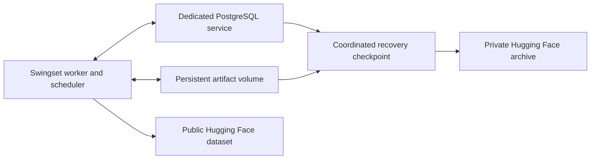
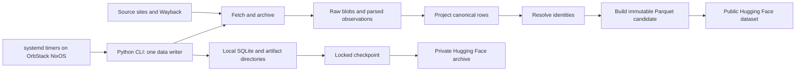
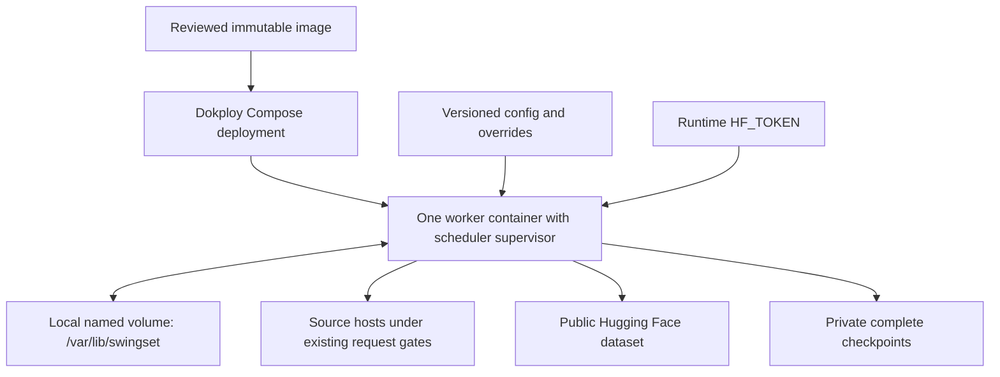

# Swingset on Dokploy: migration review

> Historical record. Dates, status claims, and instructions below describe the
> original work. See [current status](../../../docs/status.md) before acting.
> [Project journal](../../README.md)

Reviewed 2026-09-14. This is a proposal, not a deployment receipt. Sources are
the current working copy, retained operating receipts, and official product
documentation. Existing uncommitted design edits were included in the review
but left unchanged. No authenticated server inspection or deployment was made.

The follow-up [PostgreSQL implementation plan](postgres-migration-plan-2026-09-14.md)
now provides the detailed port, import, checkpoint, and cutover sequence, with
schema inventory findings and isolated PostgreSQL experiment results.

## Recommendation

Following the owner's preference for PostgreSQL, the preferred target is now
**one Swingset worker, a dedicated Dokploy-managed PostgreSQL service, and a
persistent artifact volume**. The database port is a prerequisite to that
cutover. The original SQLite-preserving deployment below remains a smaller
alternative if moving the host sooner becomes the priority.

### PostgreSQL target: follow-up review

PostgreSQL fits the intended operating environment: Dokploy exposes database
deployment, logs, resource monitoring, scheduled S3 backups, and restore.
Use a dedicated Swingset database service and role, separate from Dokploy's own
internal database. Configure private connectivity between the worker and database;
there is no application requirement for a public database port.
[Database management](https://docs.dokploy.com/docs/core/databases),
[scheduled backups](https://docs.dokploy.com/docs/core/databases/backups),
[restore](https://docs.dokploy.com/docs/core/databases/restore).

The relational domain model can remain: observations, canonical rows, work
records, generation manifests, controls, and receipts belong in PostgreSQL.
Raw bodies, extracts, captured inputs, and Parquet candidates remain files for
the first port. Keep the worker on the host with that artifact volume. Moving
the database alone does not make workers interchangeable across hosts.

The port reaches beyond `state/db.py`. A broad static search found SQLite APIs
or dialect-related constructs in 97 runtime/migration files; this includes type
annotations and is a coupling indicator, not a count of 97 difficult rewrites.
Concrete changes include:

| Area               | Required work                                                                                                                                                                                                                                                                                  |
| ------------------ | ---------------------------------------------------------------------------------------------------------------------------------------------------------------------------------------------------------------------------------------------------------------------------------------------- |
| SQL and schema     | Replace `?` parameters, `INSERT OR IGNORE/REPLACE`, JSON/date functions, SQLite catalog queries and migrations. Define explicit ordering where code uses `rowid` as a tie-breaker; preserve its meaning during import.                                                                         |
| Transactions       | Reproduce atomic work units and stable multi-query build/report snapshots. PostgreSQL's default Read Committed permits successive queries in one transaction to see different committed states; use an explicit snapshot policy such as Repeatable Read where required.                        |
| Coordination       | Preserve one data writer and the separate control admission boundary. PostgreSQL advisory locks can replace process file locks, but session lifetime, connection loss, lock order, and external publication effects need explicit handling. Losing the lock connection must stop further work. |
| Publication guards | Port the SQLite triggers that reject semantic writes during publication, while allowing control changes. Verify races under PostgreSQL concurrency rather than translating trigger syntax alone.                                                                                               |
| Deadlines          | Replace SQLite progress-handler cancellation. Server statement/lock timeouts help, but neither alone reproduces the existing whole-unit wall-clock bound, including Python execution.                                                                                                          |
| Checkpoints        | Replace the SQLite backup API and file restore with a database dump/import protocol coordinated with the exact artifact manifest and pending publication state. Preserve access to legacy SQLite checkpoints through import tooling.                                                           |
| Verification       | Run persistence and recovery tests against real PostgreSQL. Audit imported keys, references, ordering, input hashes, source budgets, controls, and public baseline, then compare a built candidate's logical content. Benchmark query round trips and batch work where needed.                 |

Code anchors: [database lifecycle](../../../src/swingset/state/db.py),
[control lock](../../../src/swingset/state/control_lock.py),
[publication triggers](../../../src/swingset/state/publication_fence.py),
[write deadlines](../../../src/swingset/state/write_deadline.py),
[release ordering](../../../src/swingset/build/closure.py), and
[checkpoint code](../../../src/swingset/backup/checkpoint.py).
PostgreSQL documents the relevant
[snapshot semantics](https://www.postgresql.org/docs/14/transaction-iso.html),
[advisory locks](https://www.postgresql.org/docs/17/explicit-locking.html), and
[timeouts](https://www.postgresql.org/docs/current/runtime-config-client.html).

Dokploy's database backup is useful, but does not capture Swingset's external
files. `pg_dump` produces a consistent database backup under concurrent use;
the application must still retain every file referenced by that exact snapshot
and preserve publication markers. A database dump and an independently timed
artifact backup are not automatically a complete recoverable checkpoint.
For the initial implementation, use a held maintenance boundary to coordinate
them, verify a shared checkpoint manifest, and test restoration plus public-head
reconciliation. [PostgreSQL dump documentation](https://www.postgresql.org/docs/17/app-pgdump.html).

Recommended order: port and verify PostgreSQL locally in containers, import a
frozen SQLite checkpoint, rehearse replay/build/recovery, then deploy both
services on sandile.dev and perform one controlled writer cutover. Keep the
old SQLite state as a rollback artifact, without ongoing dual writes. PostgreSQL
becomes the production backend; retaining two production backends is not needed
for this goal. The recorded schema-14/schema-15 release boundary still needs
an explicit decision before constructing the importer.

### Original SQLite-preserving option

Dokploy is a reasonable host for Swingset. The owner reports an 8-core Xeon,
60 GB RAM, and 800 GB disk at sandile.dev, which provides substantial capacity
relative to the current 8 GiB VM. Available resources and other workloads still
need inspection. Deploy one Docker Compose worker, keep SQLite and the evidence
archive on one persistent local volume, and retain the existing Hugging Face
publication and checkpoint protocols. The pipeline does not need an inbound
HTTP endpoint, another database service, or a distributed queue.

The substantial work is the runtime and operating layer: package an immutable
image, replace systemd's scheduling and shutdown behavior, preserve operator
holds, and rehearse the state transfer. Moving the host also changes captured
runtime identity and can require expensive replay. It is not just copying a
database and starting the current checkout.

Prefer ordinary Compose mode for this single-host deployment. Dokploy also
offers Stack mode through Docker Swarm; Stack cannot build an image from a
Compose `build` directive. Both modes can use a prebuilt image.
[Dokploy Compose documentation](https://docs.dokploy.com/docs/core/docker-compose).

## What exists today

| Concern       | Implementation and migration implication                                                                                                                                                                                  |
| ------------- | ------------------------------------------------------------------------------------------------------------------------------------------------------------------------------------------------------------------------- |
| Runtime       | Python 3.12 through Nix; uv installs frozen production dependencies before systemd jobs. Native libraries include PyArrow, DuckDB, SciPy, RapidFuzz, and selectolax. Build and verify them for the server's architecture. |
| Execution     | CLI commands perform fetch, parse, project, link, build, publish, backup, restore, and reporting. There is no HTTP service or persistent worker daemon today.                                                             |
| State         | `/var/lib/swingset/state.sqlite`, WAL mode, full synchronization, local filesystem artifacts, and atomic publication markers. Preserve the complete state closure.                                                        |
| Concurrency   | `state.lock` uses `fcntl.flock` to exclude data writers, including backup and restore. Controls use a separate bounded `control.lock`. Doctor reads without the data writer lock.                                         |
| Recovery      | Transactions commit stage output and completion together. Candidates, publication intent, remote receipts, and baseline promotion have explicit recovery rules.                                                           |
| Configuration | Checked-in `config/` plus correction inputs in `overrides/`. The OrbStack host currently reads overrides from the Mac checkout's absolute path. Containers need explicit replacement paths.                               |
| Credentials   | `HF_TOKEN` comes from `/etc/swingset.env` on the VM. Public and private repository names are currently fixed in the CLI. Token presence alone does not enable cycle publication.                                          |
| Observability | Structured command logs, `runs/*.json`, `doctor`, and daily summary. Dokploy must expose these and monitor actual progress, not merely container uptime.                                                                  |
| Delivery      | Nix package/module and GitHub Actions checks exist. No Dockerfile, Compose manifest, or Docker image publishing workflow was found.                                                                                       |

Implementation anchors: [service module](../../../nix/module.nix),
[OrbStack host](../../../nix/hosts/orb.nix), [package wrapper](../../../nix/package.nix),
[dependencies](../../../pyproject.toml), [CLI](../../../src/swingset/cli.py),
[database lifecycle](../../../src/swingset/state/db.py),
[cycle](../../../src/swingset/schedule/cycle.py),
[checkpoint implementation](../../../src/swingset/backup/checkpoint.py), and
[CI workflow](../../../.github/workflows/ci.yml).

Some design text describes future dependencies. The current package uses
`pypdf`, not the technology document's `pdfplumber`; no runtime Node subprocess
was found in the Python package. Node is present in the development flake, and
real DCN parsing remains pending in the operating notes. Build the image from
the selected implementation's actual requirements.

### Recorded operating state is ahead of some docs and behind this checkout

The latest [resume handoff](2026-09-15-release-handoff.md) records production on schema
14, V1–V4 published, and all six cycle/backup/summary services and timers held.
Its recorded public baseline is
`81121dcc7d62a1db9e76ee1c49a6b90e1f4c5653`. H16 scratch replay completed, but
the subsequent build, production initialization, and release were still pending.
These are retained observations, not live checks made for this review.

The current [database module](../../../src/swingset/state/db.py) declares schema 15
and migrates on a normal writable open. Therefore deploying the current branch
could combine the host move with a schema upgrade and unfinished acceptance
work. Select and archive the intended source/runtime pin first. Keep migration
and publication holds until the selected release has passed its own gates.

## What Dokploy provides

| Capability           | Relevant documented behavior                                                                                                                                                                                                                                                                                                                  |
| -------------------- | --------------------------------------------------------------------------------------------------------------------------------------------------------------------------------------------------------------------------------------------------------------------------------------------------------------------------------------------- |
| Compose deployment   | Repository-backed Compose or a prebuilt image; named volumes and bind mounts; per-service logs and monitoring. UI environment values are written to `.env` and require explicit `environment` references or `env_file` to reach a container. [Compose](https://docs.dokploy.com/docs/core/docker-compose).                                    |
| Scheduled jobs       | Cron jobs can execute commands in running application/Compose containers or scripts on servers. Container jobs use `docker exec`; the target must already be running. Compose job discovery depends on preserving `COMPOSE_PROJECT_NAME`. [Scheduled jobs](https://docs.dokploy.com/docs/core/schedule-jobs).                                 |
| Volume backup        | Named volumes can be backed up to S3-compatible storage. Bind mounts are excluded. Stopping the container is recommended; copying a volume while it is being written can produce inconsistent data. [Volume backups](https://docs.dokploy.com/docs/core/volume-backups).                                                                      |
| Dokploy backup       | The control-plane backup covers `dokploy-postgres` and `/etc/dokploy`. It does not establish that Swingset's application volume is backed up. [Server backups](https://docs.dokploy.com/docs/core/backups).                                                                                                                                   |
| Routing              | Domains and Traefik route to an application port. Swingset currently has no such port, so leave it without a domain or published ports. [Compose domains](https://docs.dokploy.com/docs/core/docker-compose/domains).                                                                                                                         |
| Application rollback | Dokploy documents Swarm health-check rollback and registry image rollback for Applications. These revert code deployment; Swingset still needs its own compatible database and publication recovery. Do not assume the Application UI applies identically to Compose. [Rollbacks](https://docs.dokploy.com/docs/core/applications/rollbacks). |

A single unauthenticated GET to `https://sandile.dev` returned HTTP 200 with
title `Dokploy` and login content. The request used the project User-Agent and
fetched no assets. The owner supplied the 8-core Xeon, 60 GB RAM, and 800 GB disk
specifications during this review. Installed version, available resources, disk
layout, existing workloads, Git/registry integration, backup destinations, and
scheduler settings remain **unverified**. Current online docs may describe a
newer version.

## SQLite-preserving deployment details

### Image and filesystem

Use a pinned Python 3.12 Linux base and pinned uv, with frozen dependencies
installed during image build. Run the installed CLI directly at runtime.
Keep Nix for development and the old deployment during the transition. A
Nix-built OCI image is an alternative if preserving the existing toolchain
proves more valuable than a conventional Python image; the current wrapper
alone is not a self-contained container image. Astral documents installing uv
projects during Docker builds and recommends digest pinning for reproducibility.
[uv Docker guide](https://docs.astral.sh/uv/guides/integration/docker/).

Preserve a source-tree installation layout initially: `capture_runtime()` looks
relative to the imported package for `pyproject.toml` and `uv.lock`. A generic
wheel-only image can silently omit those files from the captured recipe. Include
SQL migrations, vocabularies, weights, config, overrides, and the selected source
artifact. Verify the captured file inventory inside the finished image.
[Runtime capture](../../../src/swingset/state/recipes.py).

Use a stable numeric non-root UID/GID, restrictive umask, and a writable local
state mount. Initialize volume ownership before starting the worker. Make code
and configuration read-only. Provide bounded writable temporary/cache space;
archive restore downloads and unpacks into a temporary directory, so a small
memory-backed `/tmp` could fail or consume build headroom. Exclude local state,
credentials, `.venv`, and unrelated research output from the build context.

Use local disk for SQLite, not an NFS/CIFS or object-storage mount. SQLite WAL
requires processes on the same host and does not work over a network filesystem.
[SQLite WAL documentation](https://sqlite.org/wal.html).

Record the actual Docker volume name and retain it across redeployment. Keep
only one active writer host. Separate copies of `state.lock` do not coordinate
two hosts, even when their data initially matches.

### Scheduler choice

**Recommended:** a small in-container supervisor that launches the existing CLI
commands and owns only their calendar, retry, and process lifecycle. It must not
duplicate the pipeline's durable watch/work scheduler. This is new code to write
and test; there is no existing Swingset daemon command to configure.

**Alternative:** Dokploy Compose scheduled jobs against an always-running worker
container. This gives job execution logs in the UI, but requires a deliberate
container lifecycle design. The docs do not establish systemd-equivalent missed
run catch-up, failure retry, timezone handling, or delivery of shutdown signals
to an active exec job. Verify those on the installed version before choosing it.

Preserve these settings from [the module](../../../nix/module.nix):

| Job     | Existing UTC cadence                            | Required behavior                                                                                    |
| ------- | ----------------------------------------------- | ---------------------------------------------------------------------------------------------------- |
| Cycle   | Every 15 minutes, plus up to 120 seconds jitter | `cycle --budget 12m --timer`; explicit publication mode; duplicate cycles log a skip.                |
| Backup  | Mon–Thu 04:00; Fri–Sun 04:00, 12:00, 20:00      | Wait for the writer lock; retry failures after 60 seconds; report last successful remote checkpoint. |
| Summary | Daily 08:00                                     | Preserve output and reporting cursor.                                                                |

The equivalent cron times are `*/15 * * * *`, `0 4 * * 1-4`,
`0 4,12,20 * * 5,6,0`, and `0 8 * * *`. These expressions alone do not
provide jitter, retry, or `Persistent=true` behavior. Set and verify UTC; after
downtime run a due job once rather than replaying every missed tick.

Every scheduled entry must check `/var/lib/swingset/operator-hold`. Today this
is a systemd `ConditionPathExists` check, not a general CLI guard. Preserve
`RESTORE_PENDING` handling and durable source/kind/all pauses too. A container
that starts successfully must not implicitly resume held acquisition or enable
publication.

The supervisor must forward SIGTERM to an active CLI child and wait for it.
Start with at least the existing 45-second stop grace, then validate slow-request
and heavy-stage shutdown. Compose otherwise defaults to ten seconds;
`init: true` supplies signal forwarding/reaping for its child but does not make
an arbitrary supervisor forward signals to all workers automatically.
[Compose process settings](https://docs.docker.com/reference/compose-file/services/).

### Backup, secrets, and monitoring

Continue using `swingset backup` as the primary recovery path. It takes a SQLite
backup under the application writer lock and captures referenced source bodies,
extracts, input bundles, retained generation artifacts, baseline, and pending
publication. `restore` verifies the manifest and public head before activation.
A raw volume snapshot does not replace these checks.

An optional Dokploy volume backup can add an independent S3 copy. Stop every
writer using the volume for that copy and account for the resulting collection
gap. Back up Dokploy's own configuration separately.

Inject `HF_TOKEN` at runtime, outside the image and state backup. Explicitly
wire the required variables through Compose. Keep overrides in a reviewed
image/config artifact, replacing the Mac checkout path. Preserve their bytes,
including suppressions and identity decisions, when selecting the first image.

Report scheduler heartbeat, most recent completed cycle, last successful remote
backup, failures, memory/disk usage, and pending restore/publication. Surface
operator holds as intentional state. `doctor` can succeed on an empty state and
does not by itself establish recent progress; it is not a sufficient liveness
check. Use its detailed report for diagnosis, not frequent expensive polling.

## Main migration risks

1. **Runtime changes trigger work.** The captured recipe includes Python binary,
   compiler/ABI, installed dependency RECORD hashes, and executed package bytes.
   Switching from Nix to a conventional image, or from ARM64 to AMD64, can change
   accepted recipes even at the same source revision. Measure replay in the final
   image on a restored specimen; retain this provenance checking.
2. **An ordinary command can migrate state.** Writable database opens run schema
   migration. Pin a compatible runtime and handle schema 14 to 15 separately.
   An image rollback does not reverse database migration or public HF commits.
3. **Two writers violate more than SQLite assumptions.** Independent state copies
   could duplicate source traffic, lose shared daily budgets, and compete to
   publish. Stop the former writer before target activation; keep the old copy
   held as a recovery artifact.
4. **A dry run still collects and writes locally.** `cycle --dry-run` suppresses
   publication, not fetching or local mutations. Use an offline restored specimen
   and controlled stage commands for rehearsal; do not run a live-source dry
   cycle concurrently with the old writer.
5. **Capacity needs measurement.** A retained H16 preflight reports a
   2,646,597,632-byte SQLite file, about 2.46 GiB, before all artifacts and
   checkpoint copies. The old scratch build was stopped above 6 GiB anonymous
   memory on an 8 GiB VM. The bounded-changelog fix's full build was still pending
   in the handoff, so the older v1 3 GB build result is not a current sizing proof.
   [Preflight](../../evidence/releases/h16/h16-changelog-production-preflight.json),
   [resume notes](2026-09-15-release-handoff.md).

The reported server should have ample capacity if a reasonable share is free.
For the initial rehearsal, a provisional Swingset budget of 4 CPUs and 12–16 GiB
RAM gives more headroom than the old VM while leaving room for other services.
Tune limits from measured peak use; these are proposed allocations, not a
measured minimum. Disk must cover the active state, WAL,
checkpoint copy, uncompressed transport archive, restore staging, image layers,
and a separate rehearsal state. Measure those totals and growth before assigning
a volume size. Avoid overlapping heavy builds, audits, backups, and image builds.

## Migration sequence and acceptance

1. Inventory sandile.dev read-only: installed Dokploy/Docker/Compose versions,
   CPU architecture, free memory and local disk, existing workloads, backup
   destination, and image delivery path. Recheck the current writer's actual
   runtime, schema, holds, public baseline, and latest verified checkpoint.
2. Select the reviewed release and its configuration. Resolve the outstanding
   H16 release boundary or explicitly carry the held compatible runtime. Do not
   use an unqualified branch tip as a substitute for the deployed source pin.
3. Build the immutable image and scheduler support. Validate native imports,
   packaged migrations and runtime capture, CLI execution, volume permissions,
   restart/hold behavior, and SIGTERM during a child command. Run the existing
   relevant recovery tests in the target image.
4. Restore a specific checkpoint into a separate target volume. Keep schedules
   held. `restore --writer-stopped` is an operator assertion, not remote fencing;
   actually stop the former writer before invoking activation. For a rehearsal
   while the old writer remains active, use offline specimen preparation rather
   than falsely asserting it is stopped. Verify hashes, SQLite integrity/foreign
   keys, baseline and pending intent, captured inputs, and retained artifact closure.
5. Rehearse required replay and build offline in the final runtime. Audit candidate
   integrity and semantic differences, measure peak memory/disk/time, and explain
   recipe-induced changes. Exercise backup failure/retry, overlap skipping,
   container restart, missed schedules, and loss of the process during publication
   using the existing fake-Hub recovery machinery.
6. Hold and stop all old scheduled jobs and active mutations. Produce and remotely
   verify a fresh checkpoint with the selected old runtime. Transfer that exact
   checkpoint, restore under hold on sandile.dev, and verify the public head and
   pending publication before enabling the sole target writer.
7. Run a controlled target cycle, review its output, and enable the reviewed
   schedules/publication mode at the accepted operating boundary. Confirm a remote
   checkpoint, summaries, a restart without duplicate work, and a fresh restore
   drill before retiring OrbStack.

Rollback before new target writes can reuse the held old state after stopping
the target. After local migrations or public publication, select a compatible
runtime and verified checkpoint and reconcile the actual public head. Resuming
the stale VM blindly is not a rollback protocol.

Implementation would add a Dockerfile, `.dockerignore`, Compose definition,
supervisor/wrappers, container lifecycle tests, and a deployment/restore runbook.
An image publishing CI job is optional initially but useful for digest-pinned
releases. Update the operating and technology documents when that implementation
is accepted; keep this report as the dated research record.
