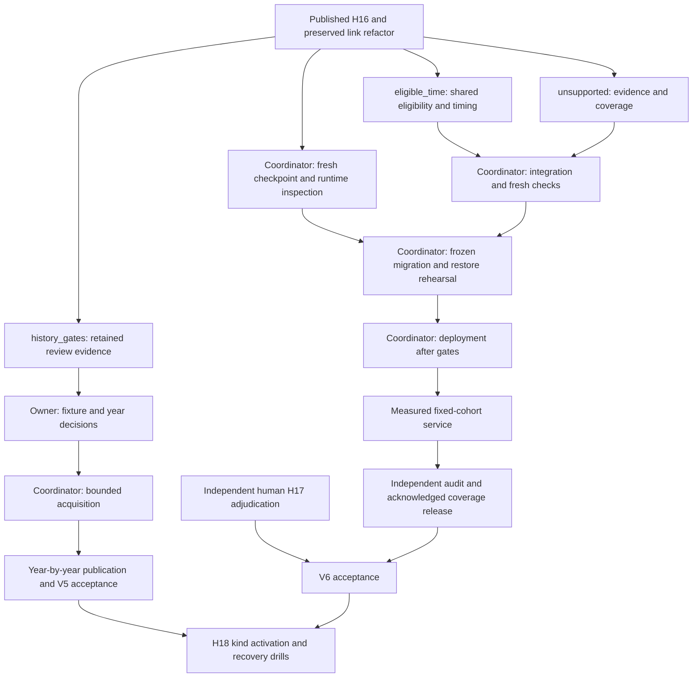

# Continue history and recovery from the published H16 baseline

Date: 2026-09-17 UTC. Work is in progress. This record does not close V5, V6 or V7.

The starting checkout was clean at `6f5c5ff8`, above the committed link refactor
`453174fb`. Its prior validation is recorded separately; it does not validate
the new bytes in this continuation.

## Ownership and dependencies

Agents share the current checkout with distinct file ownership. They do not
make jj graph changes, format the whole tree, or operate production. Timing
owns fetch eligibility and the ordinary acquisition loop. Unsupported accounting
owns page evidence, accounting and release coverage. History owns offline review
tools. The coordinator integrates common documentation and migration numbers.

## Production inspection

Read-only inspection at 15:05–15:08 UTC confirmed active and persistent system
`/nix/store/sx7lpr80cx0n9vzsi3cwz9nxawqc4p1i-nixos-system-swingset-lxc-25.11.20260630.b6018f8`,
the operator hold, and six inactive ordinary units. Their commands use frozen
source `/nix/store/z689qy41inndill3d92ym8im852x3649-source` but external overrides.
The baseline is `cand_8f31cad7226643ae`; its receipt acknowledges public commit
`2a6c7dc744fb36eabb5163c0a527d787d3721f4f`.

Only `event_aliases.csv` differs between external and frozen overrides.
Identity decisions and suppressions match. No hold was removed and no new
runtime was activated. Invoking the installed CLI's help refreshed its service
venv package binding to that same frozen source; it ran no pipeline stage.

## Fresh backup

The first checkpoint stopped on root-owned retained operation receipts. A
guarded, exact-path repair gave the service group read access to 33 files and
read/search access to one directory. All file hashes, inodes, root owners and
modification times matched afterward. See [D-0050](../../decisions/0050-give-backup-access-to-retained-h16-receipts.md)
and the [repair receipt](../../evidence/runtime/v2-continuation-2026-09-17/backup-read-access-repair.json).

The second attempt created the checkpoint, then exhausted its 4 GiB memory
limit while packaging a transport archive under RAM-backed `/tmp`. The partial
3.8 GiB archive was preserved by moving it from `/tmp/swingset-checkpoint-tenru2_j`
to `/var/tmp/swingset-checkpoint-aborted-20260917-002`, releasing its RAM backing. The third attempt
reverified the completed checkpoint and uploaded from disk-backed temporary
storage with the same limit. The backup-unit setting is implemented locally;
it has not been deployed. See [D-0052](../../decisions/0052-package-checkpoint-archives-on-disk.md).

At 15:28:35 UTC the private archive acknowledged commit
`dd33cd55e23765fe9479fc3a9f8b265299a2e868`; the helper rechecked the remote head
and manifest hash. The checkpoint is
`/var/lib/swingset/checkpoints/h16-published-20260917`, manifest SHA-256
`0fd7406ae2fc1f0014ced9a083894693af76079359231bc6613b00becc69275b`.
It contains 68,586 files and 8,739,511,386 bytes, schema 14, the acknowledged
H16 candidate and operator hold. Live database changes were zero. All ordinary
units remained inactive. [Receipts and exact scripts](../../evidence/runtime/v2-continuation-2026-09-17/)
retain both failures and the successful third operation. This is a verified
backup, not an operational restore or extension deployment.

## Phase-one continuation

The exact retained resume driver passed fresh preflight at 15:29:44 UTC against
the deployed schema-14 source. The actual pending set matched the original 17
calendar targets, accepted inputs and baseline were pinned, current parser
versions matched, and the Archive UTC debit was zero. Gate SHA-256:
`c575347878de8ea5181919e26e8607d5d4aa31bfc08c899b82c4c0c25c3ecd98`.
The controlled execution uses at most 48 additional requests and 600 cooperative
seconds, with a 660-second external stop bound. It creates no score-sheet
watches, accepts no year and leaves ordinary jobs held. It stopped normally
at 15:30:28 UTC with **zero requests**: the ordinary backpressure gate reported
31,821 queued parse units. All 17 targets remain pending. The bounded driver
did not bypass that gate or raise its limit. [Actual receipts](../../evidence/collection/phase1-resume-2026-09-17/)
retain the gate, preflight, execution and final ledger. Draining ordinary
interpretation work is necessary before retrying; an exit-zero process is not
evidence that acquisition finished.

## Pending independent gates

The owner approved the exact five-body fixture exception and retained the
2010–2016 WP14 range. See [D-0053](../../decisions/0053-approve-exact-new-source-fixture-exception.md)
and [D-0054](../../decisions/0054-keep-step-right-history-at-the-2010-floor.md).
Independent human H17 adjudication is deferred to a future review website;
see [D-0055](../../decisions/0055-defer-human-adjudication-to-a-review-website.md).
Year review exports do not authorize phase-two watches. V7 waits for V5 and V6.

## Approved fixture acquisition

The exact five-body exception completed at 15:44:06 UTC: eight HTTP requests,
130,059 bytes and 73.26 elapsed seconds. This includes Archive robots and the
DCN probe plus page zero. All five exact captures returned complete bodies;
six DCN index captures are review suggestions only. Production remained schema
14 with its hold and acknowledged H16 baseline; shared Archive usage is eight
requests and 130,059 bytes. No production watches or facts were created.
[Retained packet, bodies and receipts](../../evidence/admission/fixture-exception-2026-09-17/)
await independent interpretation review. Preliminary audit found two recorded
request-start gaps about 9 and 3 milliseconds below ten seconds; exact gate
and transport timing are under review, so spacing compliance is not asserted.

Packaging first failed safely on macOS AppleDouble files; the failed packet
remains on the VM. A clean transfer passed the unchanged closure verifier.
The first service launch then failed before Python because its PATH omitted
`env`; the second used the same authorization and quarantine with an explicit
NixOS PATH. Neither preparation failure issued a request. The maintained
preparer now emits the absolute NixOS env path; retained executed bytes remain
unchanged. See [preparation evidence](fixture-exception-preparation-2026-09-17.md).

## First integrated freeze and migration rehearsal

The first frozen source is `/nix/store/01qy6sk23bjdpyh64ky4v8hg055rz1cx-source`,
with 2,182 tracked files and source-receipt SHA-256
`a0fe7dd42bf05ebe49a35197111799ba6325f16376f3263ff6b2c352b7919283`.
It reaches schema 27. Ruff passed; mypy passed 217 source files. The NixOS
system built offline with the host's required impure configuration import:
`/nix/store/dwhbxv2kqmhm5w08fl9bx78g4c19jl92-nixos-system-swingset-lxc-25.11.20260630.b6018f8`.
It was not activated. Its cycle and backup units bind the frozen source;
backup uses disk-backed temporary storage. External overrides still require
input acceptance before ordinary collection can resume.

The first full test attempt returned 2,188 passed and four failed in 473.96
seconds. Its children were not all bound to the frozen runtime: an editable
environment imported the changing checkout. Binding `PYTHONPATH` fixed both
subprocess failures in a separate two-test run (64.76 seconds). Two older tests
needed schema/reporting updates, then passed separately (44.91 seconds). The
failed full receipt is preserved; none of these numbers is a passing full run.
See [D-0059](../../decisions/0059-bind-validation-subprocesses-and-preserve-corruption-tests.md).
The initial freeze launcher also failed before copying because the system
Python was 3.9; the successful run used the project environment.

The actual checkpoint migration rehearsal passed at 15:51:56 UTC. All 71
pre-existing application tables matched (except the specified schema-version
metadata), 43 new tables appeared, and integrity, foreign keys, reopening,
source identity and checkpoint hashes passed. This is schema 14→27 on a
scratch database; live production remains schema 14. [Receipt](../../evidence/runtime/event-extension-2026-09-17/migration-001/migration-receipt.json).

A later checkpoint captured the phase-one bookkeeping and eight paid fixture
requests without changing the live database. At 16:01:14 UTC it was privately
acknowledged as `5c6c2120bd6769c9651c5ddb2498dc1ed2762fc4` and remotely checked.
Path: `/var/lib/swingset/checkpoints/h16-before-extension-20260917-002`.
Manifest: `94f3fd605c2deb36705e99b4412ceeccd19cdb0a02e2c16f96618e86aed54341`.
It contains 68,663 files and 8,746,815,860 bytes; [backup receipt](../../evidence/runtime/v2-continuation-2026-09-17/backup-004/).
An operational restore rehearsal against that checkpoint ran from 16:03:45
through 16:15:55 UTC in disposable held state. It passed the actual restore
protocol, verified all 35 public candidate files and the unchanged remote head,
activated schema 14 under the copied hold, and migrated to schema 27. All 71
prior application tables and retained private files were preserved. No worker,
input acceptance, source acquisition, repair activation or public write occurred.
[Exact helper, receipt and log](../../evidence/runtime/event-extension-2026-09-17/restore-001/)
bind this result to the first frozen runtime; it does not accept schema 28.

## Second integrated freeze and exact DCN index

The second frozen source is `/nix/store/bryq9j3z6rmy2fmm1k4qqj6vp7hp2a39-source`,
with 2,221 files, schema 28 and source-receipt SHA-256
`ab09a5c859384b7a39267a81660f81252dea14c9d9462a6545e1eec8f15f2f91`.
Its NixOS system built as
`/nix/store/sklq0w5hgf6pmv8cz1kkliw2cfav987s-nixos-system-swingset-lxc-25.11.20260630.b6018f8`;
it was not activated. Mypy passed 217 source files. The frozen full test run
returned **2,237 passed and two failed in 546.78 seconds**. Both failing tests
attempted requests that the new spacing contract correctly blocks: an immediate
post-crash request and a live request under a legacy schema without spacing
state. Focused corrections now preserve those interlocks; another frozen full
run is required. [Failed full receipt](../../evidence/runtime/event-extension-2026-09-17/validation-002/pytest.log).

The separately approved DCN index ran at 16:15:50–16:16:12 UTC. It captured the
exact 20251112105828 Archive body using two requests, including robots, and
2,804,642 bytes. The independent audit verified hashes, allowlist, limits and
the recorded completion-to-next-dispatch gap of 10.020765261 monotonic seconds.
This is transport-dispatch evidence, not a claim about wire timing.
[Executed packet and evidence](../../evidence/admission/dcn-index-fixture-2026-09-17/)
and [independent audit](../../evidence/admission/dcn-index-review-2026-09-17/audit.json)
are retained separately from the original fixture run. No PDFs or child bodies
were requested and no production facts or watches were created.

The 16:22:53 UTC read-only check still found the original active and persistent
H16 system, schema 14, the same public baseline, operator hold and six inactive
ordinary units. Current-day shared Archive usage was ten requests and 2,934,701
bytes. The 31,821-unit parse backlog remains. A new verified checkpoint is being
prepared to include these final paid fixture requests before rollout rehearsal.

## Current reviewed rollout candidate

The third freeze preserves every runtime byte from the second freeze and
changes only the two corrected scheduler tests. In-progress DCN parsing and
separately reviewed operating helpers are excluded. Its source is
`/nix/store/dx0cyzvd8d91rf29v21sakbr7l5bwxnz-source`, receipt SHA-256
`60cdfe64004a0ba5a9aee207bcb089d6d4c81f5ca58169ccdb88a5dfab8146d6`.
[Inventory and selected diff](../../evidence/runtime/event-extension-2026-09-17/validation-003/)
record that boundary. The full run passed **2,239 tests in 620.29 seconds**;
Ruff and mypy over 217 source files also passed. Both local and Nix-store source
inventories remained exact. [Closed validation receipt](../../evidence/runtime/event-extension-2026-09-17/validation-003/validation.json).
These results exclude subsequent DCN parser and operating-helper changes. System
`/nix/store/lzwkabfmbz46d05yi5k41nq56i7jjh74-nixos-system-swingset-lxc-25.11.20260630.b6018f8`
built offline. Its [service binding](../../evidence/runtime/event-extension-2026-09-17/validation-003/service-binding.json)
verified the package, exact config and external override files, hold conditions,
and disk-backed backup temporary directory. This does not accept runtime inputs
or activate the system.

At 16:28:55 UTC the fresh schema-14 checkpoint passed verification and remote
acknowledgment as private archive commit
`da38556935ee18ee26a93e121ef461514ac2f423`. It contains 68,688 files and
8,750,847,629 bytes, with zero live database changes. Path:
`/var/lib/swingset/checkpoints/h16-before-extension-20260917-003`; manifest
`22102b3cc07b07b49800c702396a748bbbe733e148bbca9b426bff370792223d`.
[Backup receipt](../../evidence/runtime/v2-continuation-2026-09-17/backup-005/).
Schema-14→28 migration and actual operational restore rehearsals began at
16:29:34 UTC in separate disposable held states. The migration rehearsal passed
at 16:34:51 UTC: all 71 predecessor tables were preserved, 45 new tables appeared,
and integrity, foreign keys, checkpoint identity and reopening checks passed.
[Migration receipt](../../evidence/runtime/event-extension-2026-09-17/migration-002/migration-receipt.json).
The corresponding operational restore passed at 16:43:12 UTC. It verified the
35 manifest-listed public files plus the manifest itself, completed both restore
head checks and a final remote head check, preserved all 71 predecessor tables,
and reopened schema 28 under the copied operator hold. It used 112 bounded
public-repository read requests and issued no source requests or public writes.
[Restore receipt and exact helper](../../evidence/runtime/event-extension-2026-09-17/restore-002/).
The final read-only production preflight has started. No system activation,
live migration, input acceptance or new publication has occurred.

At 16:39:28 UTC a separate read-only spacing proposal assessed actual paid-host
state under both locks without migrating schema 14. The combined ten-request
Archive evidence supports a ten-second baseline. Six other paid hosts remain
unknown because their original last-request policy is not proved. The
[proposal and exact helper](../../evidence/runtime/legacy-spacing-baseline-2026-09-17/production-prepare-001/)
record this assessment; no spacing baseline has been applied. The independent
review fixed a trigger-origin write escape before preparation; that repair
prevents a trigger from creating spacing authority for an unreviewed host.

## Held deployment and live migration

The final read-only preflight passed at 16:48:45 UTC. The reviewed candidate-003
system became active and persistent at 16:50:08 UTC. Its guarded schema 14→28
migration passed at 16:59:15 UTC. All 71 predecessor application tables retained
identical row counts, columns and hashes; 45 new tables were added. The hold
remains, and all six ordinary units were inactive at the migration guards.
[Deployment receipt](../../evidence/runtime/event-extension-2026-09-17/deployment-001/deployment-receipt.json)
and [live migration receipt, gate and executed helper](../../evidence/runtime/event-extension-2026-09-17/live-migration-001/)
record these separate completed operations. No production input acceptance,
collection, repair activation or new publication occurred in either operation.

A separate full checkpoint copy and schema-28 scratch preparation passed at
16:56:47 UTC. Its [retained marker and exact helper](../../evidence/runtime/extension-input-rehearsal-2026-09-17/production-copy-001/)
bind disposable state `/var/tmp/swingset-extension-input-20260917-001` to the
same checkpoint and runtime. Input acceptance is now being rehearsed in that
copy only. This is not live input acceptance or measured production service.

The owner approved the exact Riga results metadata lookup in D-0069. Runner
review and execution checks remain; no lookup request has yet been made.

Independent post-migration verification passed all 42 checks at 17:06:23 UTC:
seven protected live tables matched, the hold and six inactive ordinary units
remained, and the public acknowledgment was unchanged. This is a local receipt
and state check, not a new remote-publication verification. See the
[independent outcome](event-extension-postmigration-independent-2026-09-17.md).
The guarded Archive spacing baseline was then applied at 17:07:15 UTC from the
reviewed ten-request evidence, without changing budgets or issuing a request.
[Application receipt](../../evidence/runtime/legacy-spacing-baseline-2026-09-17/production-apply-001/application-001.json).
The six unsupported legacy host baselines remain blocked.

Scratch input acceptance passed at 17:05:00 UTC with bundle
`27528a47da5f702a4ff2ea68c1bfe2a2ce608989600fd9bc7e6734b4c74a0c95`,
preserving all 4,931 named judges. The first bounded ordinary offline drain is
running in the same disposable state. Production inputs remain unaccepted.

The first scratch drain closed at 17:15:26 UTC with preservation checks passing.
It completed one parse and three projections in its 550.008-second selection
window, then stopped at the selection time limit. There was no selection-budget
overrun. All 4,931 named judges remained unchanged; 31,820 parse hints and two
projection hints remain, and complete fleet derivation history is unassessed.
[Closed turn](../../evidence/runtime/extension-input-rehearsal-2026-09-17/production-copy-001/drain-001.json).
This low throughput requires selector profiling before operating acceptance;
a passing bounded-turn receipt alone does not establish useful service.

The exact D-0069 metadata lookup passed independent runner review (47 offline
checks, Ruff and deterministic rebuild) and production preparation. It began
under the held schema-28 runtime after the scratch turn stopped. It remains
separate from production acquisition and historical-year acceptance.

## Exact Riga results body captured at 17:43 UTC

Under D-0073, the separately reviewed runner captured the exact
`20190719204919` results HTML. Both requests settled: Archive robots returned
404 with 146 bytes; the exact HTML returned 200 with 16,693 bytes and matching
Memento time. Total accounted response-body bytes were 16,839, with a
10.016828-second completion-to-dispatch gap. Shared Archive usage reached
15 requests and 2,951,909 bytes. No PDFs, children, metadata, redirects or
retries were requested. The held schema-28 runtime and acknowledged public
baseline remain unchanged. The
[retained packet and acquisition receipts](../../evidence/admission/dcn-results-body-2026-09-17/)
passed [independent acquisition review](../../evidence/admission/dcn-results-body-2026-09-17/independent-review-001/checks.json); interpretation remains unreviewed quarantine evidence. No source kind or historical year was accepted.

The independently reviewed schema-28 checkpoint helper was launched after the
fixture process stopped. It preserves the existing accepted bundle and hold;
its fresh backup and private acknowledgment remain pending until receipts close.

## Schema-28 backup attempt and narrow access repair

The first new checkpoint stopped at 17:49 UTC because the root-owned extension
preflight receipt was not service-readable. Inventory found exactly two such
operation files: preflight and live-migration receipts, both mode 0600. Under
the writer and control locks, the coordinator preserved their hashes, inodes,
root ownership and modification times while granting the service group read
access with mode 0640. No database was opened and the hold stayed intact.
[D-0082](../../decisions/0082-give-backup-read-access-to-extension-receipts.md)
and the [exact repair](../../evidence/runtime/schema28-checkpoint-2026-09-17/receipt-access-001/receipt.json)
record this scope. The [failed attempt](../../evidence/runtime/schema28-checkpoint-2026-09-17/production-001/)
and partial checkpoint are retained. The unchanged reviewed helper is retrying
into `extension28-held-20260917-002`; it is not verified until its receipt closes.

## Selector comparisons remain operating work

Comparison 002 removed repeated dancer proof scans, but still stopped at its
30-second selection limit. It recorded 25 million work-unit hash calls and
repeated full cohort construction across 285 blocked link candidates. It also
overlapped the held backup, so these wall times are not isolated service rates.
[D-0081](../../decisions/0081-check-shared-link-prerequisites-before-event-expansion.md)
checks the exact common dancer prerequisite before event-specific expansion.
The local change passed 55 focused tests in 18.46 seconds; independent review
and a fresh profile remain required. Neither cache derivative was deployed.

The first transfer of comparison-source-002 carried macOS metadata sidecars.
Inventory inspection rejected it before execution. A separate clean transfer
used only the exact manifest files; the source-bound helper verified its full
inventory before and after profiling. The contaminated store path was never
used as a runtime or profiling source.

## Current-schema checkpoint closed at 17:56 UTC

The second schema-28 attempt passed. Checkpoint
`/var/lib/swingset/checkpoints/extension28-held-20260917-002` has manifest
`4929859092cbd3e15122f3598b5da477a65498976cc744c52cf2b142d1cebea3`,
68,812 files and 8,767,609,759 bytes. Private archive commit
`d71060d4f77b6073f797bd7232bf2aa3694ba685` was acknowledged and its manifest
matched. The [receipt](../../evidence/runtime/schema28-checkpoint-2026-09-17/production-002/receipt.json)
records zero live database writes and preserved ordinary holds. This is a
backup receipt, not a completed restore drill or new public publication.

The owner subsequently supplied standing approval until v2 implementation is
done. [D-0087](../../decisions/0087-authorize-remaining-v2-acquisition-and-operations.md)
replaces repeated fixture permission requests while retaining concrete scopes,
independent review, budgets and runtime gates. The decision was initially
numbered D-0083 and renumbered after a concurrent JesAnn decision collision;
the owner instruction is unchanged and foreign work is preserved.

## Reviewed selector and integrated candidate 004

The five-file selector derivative completed the same read-only scratch
selection in 9.094867 seconds and selected one pending parse. Its
[profile](../../evidence/runtime/offline-selector-profile-2026-09-17/comparison-004/report.json)
records zero writes, workers and network requests. Earlier 30-second timeout
receipts remain retained. This is instrumented selection, not sustained
throughput or extension acceptance.

After coordinated `mise run fmt`, candidate 004 froze 2,572 files at source
`/nix/store/c0dpchrf4b6hkxlc2yn4jm1v96ld0xd2-source`, receipt
`44208cb5b38f0cd3f8b6c7c91f1b5d1cd650ef677d52b4bd54c17d8576c485e7`.
It includes schema 29, reviewed DCN HTML and newsletter work, and the selector
fixes. Two later PDF metadata helper files are explicitly excluded. Its
full tests are running separately. The offline NixOS build passed;
`/nix/store/qafwymyx9nf7wm708n6ikyqxk3dxy5xa-nixos-system-swingset-lxc-25.11.20260630.b6018f8`
has not been activated. The first pure Nix evaluation rejected the host's
configured absolute `/etc/nixos/configuration.nix` import; the required
`--impure --offline` build succeeded. Both logs are retained.

## Exact PDF metadata lookup closed at 18:10 UTC

Under D-0087, the reviewed two-URL runner used five HTTP requests and 156
response-body bytes. Shared Archive usage is now 20 requests and 2,952,065
bytes. Each probe reported one page, but both page-zero responses were the
exact JSON `[]` with no capture rows. The
[independent acquisition audit](../../evidence/admission/dcn-score-pdf-lookup-2026-09-17/independent-review-001/checks.json)
passed. This is a limited negative lookup, not proof that either file was
never archived. No PDFs or origin requests were made in this operation.
The latest verified checkpoint predates these five debits; it retains the
15-request state at its recorded cutoff. Current production remains schema 28
under hold, with the same acknowledged public baseline.

## Current bounded ownership

The coordinator alone owns source freezes, integration checks, production
request admission, checkpointing, migration, deployment and publication.
`history_gates` prepares the schema-28-to-29 rehearsal packet; `eligible_time`
independently reviews it; `unsupported` audits metadata and prepares the
separate exact origin-fixture scope. Reviewed parser and selector source is
frozen during integration validation. Later helpers receive separate pins
and reviews. No old workspace graph is revived.

The next runtime path is frozen validation and service binding, then reviewed
migration/restore and scratch input replay, followed by live preflight and
controlled deployment. Fixture work proceeds independently through exact scope,
runner review, acquisition audit, parser controls and source-kind admission.
Year review and H17 human evidence remain explicit gates; no stage acceptance
is inferred from local tests or this operating progress.
